# 推荐系统

## 1. 推荐系统的基本概念

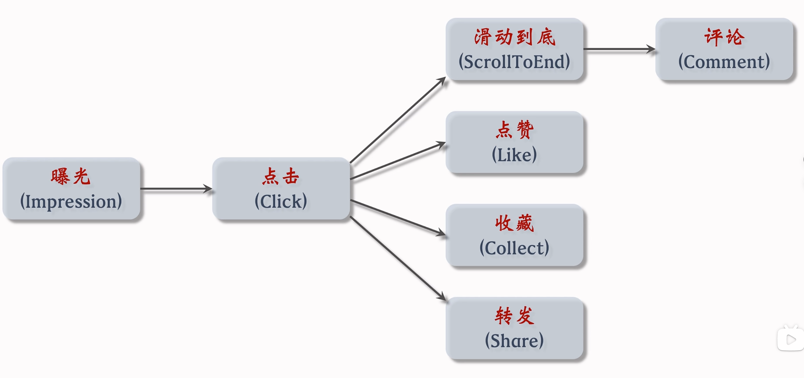
Clink，ScrollToEnd，Like，Collect，Share，Comment 都是推荐系统进行推荐的依据

#### 1.1. 消费指标

对于每篇笔记，系统记录：

- 曝光次数(number of impressions)
- 点击次数(number of clicks)
- 点赞次数(number of likes)
- 收藏次数(number of collects)
- 转发次数(number of shares)

&emsp;&emsp;点击率=点击次数/曝光次数
&emsp;&emsp;点赞率=点赞次数/点击次数
&emsp;&emsp;收藏率=收藏次数/点击次数
&emsp;&emsp;转发率=转发次数/点击次数
&emsp;&emsp;阅读完成率=滑动到底次数/点击次数 \* f(笔记长度)

> 点击率越高，反应推荐系统越精准
> 消费指标用来衡量用户的短期兴趣

#### 1.2. 北极星指标

- 用户规模
  - 日活用户数(DAU)、月活用户数(MAU)
- 消费
  - 人均使用推荐的时长，人均阅读笔记的数量
- 发布
  - 发布渗透率、人均发布量

> 北极星指标是最重要的标准，是衡量一个推荐系统好坏的根本标准

#### 1.3. 实验流程

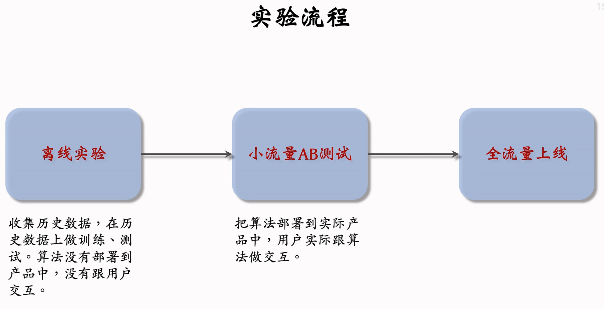
**离线实验**：收集历史数据，在历史数据上训练、测试。算法没有部署到产品中，没有跟用户交互
**小流量 AB 测试**：把算法部署到实际产品中，用户实际跟算法交互，把用户分为 A、B 组，进行对照实验
**全流量上线**：把算法推广到全部用户

## 2. 推荐系统的链路

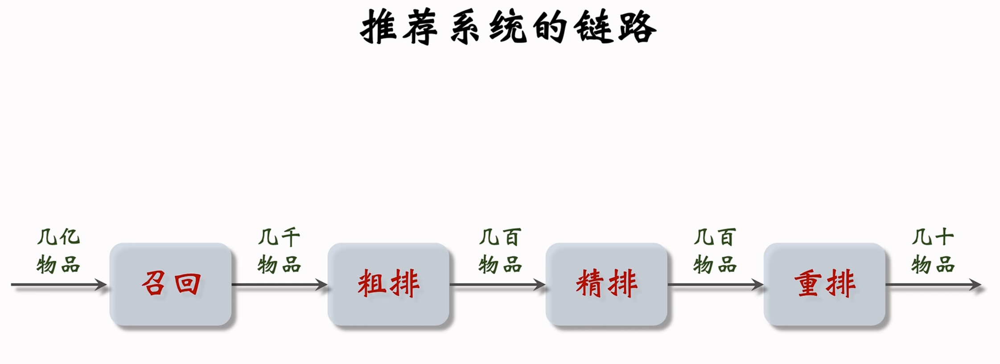
**召回**：从物品数据库中快速取回一些物品，使用多条召回通道同时进行召回操作
**粗排**：用简单的机器学习模型对取出的物品进行打分，保留分数比较高的物品(截断)
**精排**：用大规模的神经网络模型对这些物品进行打分，可以截断也可以不截断
**重排**：根据精排分数和多样性进行抽样，把相似的内容打散，并插入广告和运营内容

#### 2.1. 召回通道

常见的召回通道有：协同过滤、双塔模型、关注的作者、等等
系统对召回通道返回的所有结果进行融合和过滤

#### 2.2. 排序

排序分为粗排和精排
召回通道返回的物品数量很多，如果使用高精度神经网络模型进行打分，花费代价很大
粗排：使用小规模神经网络模型对大量物品进行打分，得到小部分评分高的物品
精排：使用大规模神经网络模型对粗排结果重新打分，使用的特征比粗排多得多，精排打得分更加可靠

##### 2.2.1. 模型执行流程

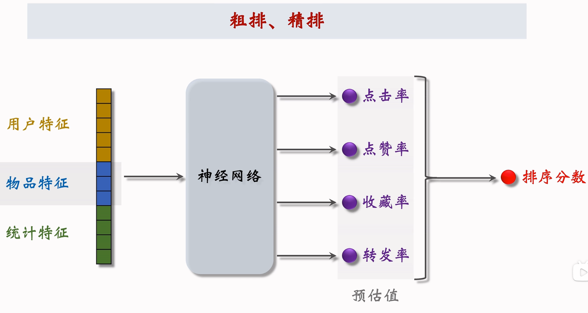

模型输入参数包括用户特征、物品特征、统计特征
模型输出预测的点击率、点赞率、收藏率、转发率
根据预测的结果给出排序分数

#### 2.3. 重排

&emsp;&emsp; 1. 做多样性抽样(比如 MMR，DPP)，从几十个物品中选出几十篇，多样性抽样的依据是精排分数大小和多样性
&emsp;&emsp; 2. 用规则打散相似笔记，保证相似笔记在展示位上相隔一段距离
&emsp;&emsp; 3.插入广告、运营推广内容，根据生态要求调整排序

## 3. 推荐系统的 AB 测试

**作用 1：** 考察新的召回通道对线上指标的影响
**作用 2：** 模型中有一些参数，比如 GNN 的深度取值$\in${1，2，3}，需要用 A/B 测试选取最优参数

#### 3.1. 随机分桶

全部$n$位用户，分成$b$个桶，每个桶中有$\frac{n}{b}$位用户，如果用户数量足够大，每个桶的 DAU 等指标应相同。

1. 首先用哈希函数把用户 ID 映射成某个区间内的整数，然后把这些整数均匀随机分成$b$个桶。
2. 设置对照组，及实验条件不同的实验组。
3. 计算某个桶的业务指标，比如 DAU，人均使用推荐的时长，点击率等等
4. 如果某个实验组指标显著优于对照组，则说明对应的策略有效，值得推全

#### 3.2. 分层实验

信息流公司的业务和部门很多，可能出现用户数量不够实验使用

- **分层实验**：召回、粗排、精排、重排、用户界面、广告····(例如 GNN 召回通道属于召回层)
- **同层互斥**：GNN 实验占了召回层的 4 个桶，其他召回实验只能用剩余的 6 个桶
- **不同层正交**：每一层独立随机对用户做分桶。每一层都可以独立用 100%的用户做实验

> 同一个层，一个用户只可接受一个实验，对于不同的层，一个用户每个层可以接受一个实验

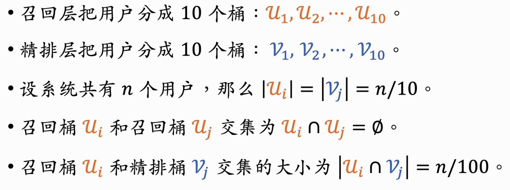
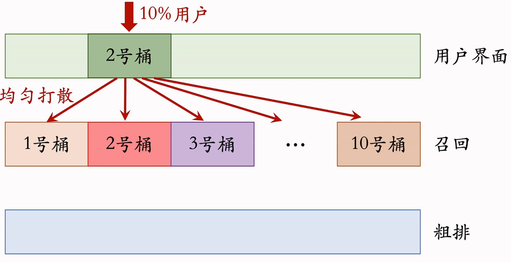

- 如果所有实验都正交，则可以同时做无数组实验。
- 同类的策略(例如精排模型的两种结构)天然互斥，对一个用户，只能用其中一种。
- 同类的策略(例如添加两条召回通道)效果会相互增强或抵消。互斥可以避免同类策略相互干扰
- 不同类型的策略(例如添加召回通道、优化粗排模型)通常不会相互干扰，可以作为正交的两层

#### 3.3. Holdout 机制

- 每个实验(召回、粗排、精排、重排)独立汇报对业务指标的提升
- 公司考察一个部门(比如推荐系统)在一段时间内对业务指标总体的提升
- 取$10\%$的用户作为 holdout 桶，推荐系统使用剩余$90\%$的用户做实验，两者互斥
- $10\%$holdout 桶 VS$90\%$实验桶的 diff(需要归一化)为整个部门得到业务指标收益
- 每个考核周期结束之后，清除 holdout 桶，让推全实验从$90\%$⽤户扩⼤到$100\%$⽤户。
- 重新随机划分⽤户，得到 holdout 桶和实验桶，开始下⼀轮考核周期。
- 新的 holdout 桶与实验桶各种业务指标的 diff 接近 0。
- 在一个考核周期中，随着召回、粗排、精排、重排实验上线和推全，diff 会逐渐扩⼤。
  

#### 3.4. 实验推全 & 反转实验

**实验推全：** 所有的实验都是从小流量开始，如果业务指标的 diff 显著正向，则推全实验。举个例子，我们做一个召回通道的实验，取 1 个桶作为实验组，1 个桶作为对照组。如果观测到显著正向的业务指标收益，则推全这条召回通道，让它从 10%的用户扩大到 90%。假设这条召回通道可以提升+1 分钟的人均使用推荐时长。考察与 holdout 桶的 diff，那么在 10%小流量实验期间，该召回通道贡献+1/9 分钟；在推全之后，它贡献了+1 分钟。

**反转实验：** 上线一个有效的实验之后，需要观察很多指标，有的指标会立即被新策略影响，而有的指标有滞后性。点击率、点赞率、完播率等指标会立刻被新策略影响，实验上线 1 天、或者实验上线 10 天，观测到的指标不会差距太大。用户使用推荐的时长、曝光的物品数量这些指标有一点滞后，需要多观察几天，指标才能稳定。用户留存指标滞后非常严重，有可能短期内观测不到显著变化，但是在之后几个月中持续改善。指标滞后的原因不难理解，新策略改善用户体验，需要一些时间才能被用户感受到，感受到之后，用户对产品的粘性才越来越高。
&emsp;&emsp; 算法工程师希望在小流量实验观测到显著收益之后，尽快推全新策略，这样可以腾出桶供其他实验使用，而且有时需要基于新策略做后续迭代优化。很多核心业务指标却具有滞后性，过快推全则观测不到完整的实验收益。实践中常用反转实验解决这对矛盾。如图 2.4 所示，每推全一个实验就新建一个推全层，它覆盖 90%用户，新的推全层与召回等层正交。在推全层中，85%的用户使用新策略，5%的用户(反转桶)使用旧策略，这样就可以长期观测新策略与旧策略业务指标的 diff。当考察周期结束，清除 holdout 桶时，将新策略应用到 holdout 桶的 10%用户。当反转实验完成时，关闭实验，则新策略会应用到反转桶的 5%的用户(此时真正推全)。
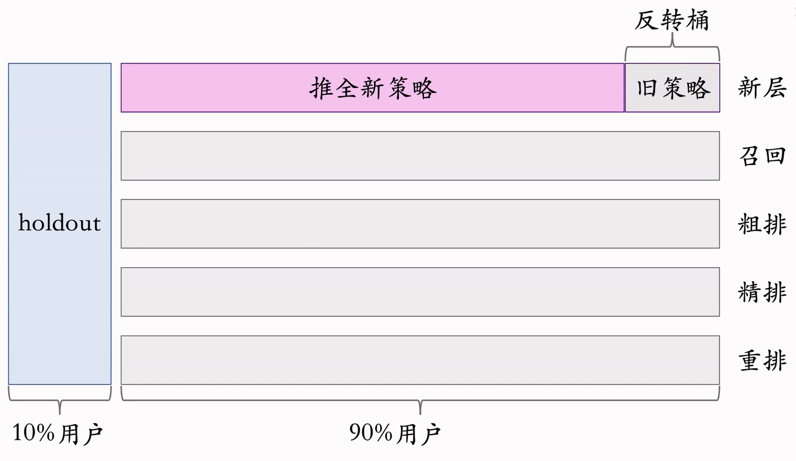

## 4. 召回：基于物品的协同过滤(ItemCF)

#### 4.1. ItemCF 的实现

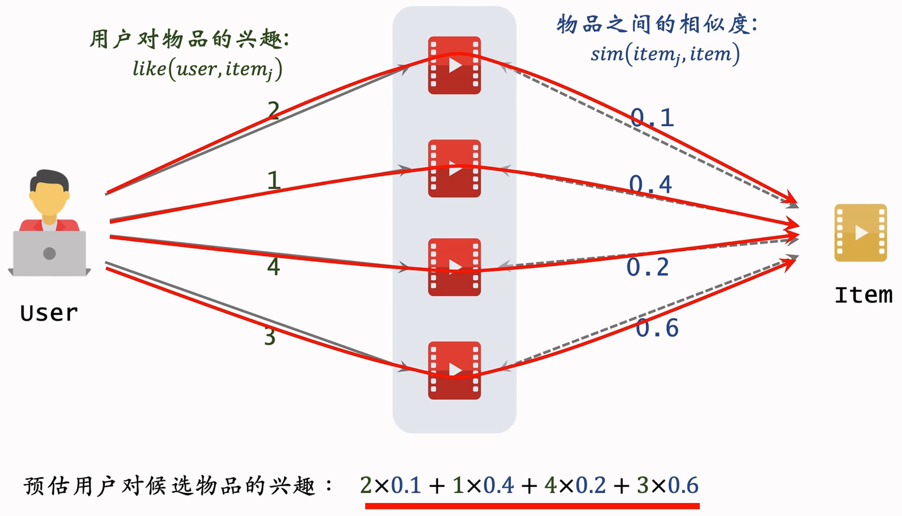
从之前用户的使用活动中，得出用户对不同物品的兴趣，并进行打分。另外计算数据库中物品与用户感兴趣的物品之间的相似度。用户对每一项物品的兴趣乘以物品之间的相似度，总和即为用户对候选物品的兴趣。

#### 4.2. 物品相似度

两个物品的受众重合度越高，两个物品越相似

- 喜欢物品$i_{1}$的用户记作集合$W_{1}$
- 喜欢物品$i_{2}$的用户记作集合$W_{2}$
- 定义交集$V=W_{1}\cap W_{2}$
- 两个物品的相似度：$sim(i_{1},i_{2})=\frac{\left| v \right|}{\sqrt{\left| w_{1} \right|\cdot \left| w_{2} \right|}}$

  > 公式没有考虑喜欢的程度$like(user,item)$

- 加入喜欢程度的相似度：$sim(i_{1},i_{2})=\frac{\sum \limits_{v\in V}like(v,i_{1})\cdot like(v,i_{2})}{\sqrt{\sum\limits _{u_{1}\in W_{1}}like^{2}(u_{1},i_{1})}\cdot \sqrt{\sum \limits_{u_{2}\in W_{2}}like^{2}(u_{2},i_{2})}}$
  > 余弦相似度(cosine similarity)

#### 4.2. ItemCF 召回的完整流程

1. 事先做离线计算
   1. 建立“用户->物品”的索引
   - 记录每个用户最近点击、交互过的物品 ID
   - 给定任意用户 ID，可以找到他近期感兴趣的物品列表
   2. 建立“物品->物品”的索引
   - 计算物品之间两两相似度
   - 对于每个物品，索引它最相似的 k 个物品
   - 给定任意物品 ID，可以快速找到它最相似的 k 个物品
2. 线上作推荐
   1. 给定⽤户 ID，通过“⽤户->物品”索引，找到⽤户近期感兴趣的物品列表(last-n)。
   2. 对于 last-n 列表中每个物品，通过“物品->物品”的索引，找到 top-k 相似物品。
   3. 对于取回的相似物品(最多有$nk$个)，⽤公式预估⽤户对物品的兴趣分数
   4. 返回分数最⾼的 100 个物品，作为推荐结果。
      > 索引的意义在于避免枚举所有的物品。
      > ⽤索引，离线计算量⼤，线上计算量⼩。

## 5. 召回：Swing 模型

由于 ItemCF 通过用户重合度判断两个物品的相似性，可能会出现因为用户小圈子聚集导致毫不相关的物品被判为相似，Swing 模型的提出是为了降低用户小圈子聚集带来的误差。

#### 5.1. Swing 模型

- ⽤户$u_1$喜欢的物品记作集合$J_1$
- ⽤户$u_2$喜欢的物品记作集合$J_2$
- 定义两个用户的重合度：$overlap(u_{1},u_{2})=\left|J_{1}\cap J_{2}\right|$
- ⽤户$u_1$和$u_2$的重合度⾼，则他们可能来⾃⼀个⼩圈子，要降低他们的权重
- 喜欢物品$i_1$的⽤户记作集合$W_1$
- 喜欢物品$i_2$的⽤户记作集合$W_2$
- 定义交集$V=W_{1}\cap W_{2}$
- 两个物品的相似度：$sim(i_1,i_2)=\sum\limits_{u_1\in V}\sum\limits_{u_2\in V}\frac{1}{\alpha+overlap(u_1,u_2)}$
  > $\alpha$是人工设置的参数，需要后期调节

## 6. 召回：基于用户的协同过滤(UserCF)

#### 6.1. UserCF 的原理

根据与我兴趣相似的网友进行推荐，如果一篇笔记，网友阅读过，而我未阅读过，就会给我推荐这篇笔记

找到兴趣相似的网友的方法：

1. 点击、点赞、收藏、转发的笔记有很⼤的重合
2. 关注的作者有很⼤的重合

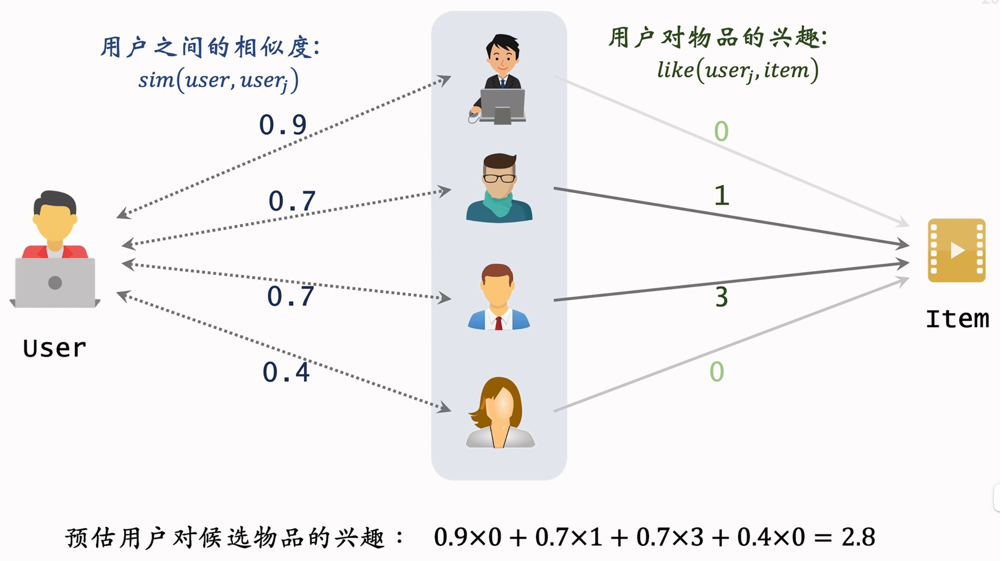
预估用户$user$对候选物品$item$的兴趣：$\sum_{j}sim(user,user_j)\times like(user_j,item)$

#### 6.2. 用户之间的相似度

- ⽤户$u_1$喜欢的物品记作集合$J_1$
- ⽤户$u_2$喜欢的物品记作集合$J_2$
- 定义交集：$I=\left|J_{1}\cap J_{2}\right|$
- 两个用户的相似度：$sim(u_1,u_2)=\frac{\left| I \right|}{\sqrt{\left| J_1 \right|\cdot \left| J_2 \right|}}$
  > 这个公式没有考虑热门物品的权重，通过热门物品计算两人的相似度没有意义
- 考虑热门物品的权重之后，两个用户的相似度：$sim(u_1,u_2)=\frac{\sum\limits_{l\in I}\frac{1}{\log{1+n_l}}}{\sqrt{\left| J_1 \right|\cdot \left| J_2 \right|}}$
  > $n_l$：喜欢物品$l$的用户数量，反应物品的热门程度

#### 6.3. UserCF 召回的流程

1. 事先做离线计算
   1. 建立“用户->物品”的索引
   - 记录每个用户最近点击、交互过的物品 ID
   - 给定任意用户 ID，可以找到他近期感兴趣的物品列表
   2. 建立“用户->用户”的索引
   - 对于每个用户，索引它最相似的 k 个用户
   - 给定任意用户 ID，可以快速找到它最相似的 k 个用户
2. 线上作推荐
   1. 给定⽤户 ID，通过“⽤户->用户”索引，找到 top-k 相似用户。
   2. 对于每个 top-k 相似用户，通过“用户->物品”的索引，找到用户近期感兴趣的物品列表(last-n)。
   3. 对于取回的相似物品(最多有$nk$个)，⽤公式预估⽤户对每个物品的兴趣分数
   4. 返回分数最⾼的 100 个物品，作为推荐结果。

## 7. 离散特征处理

#### 7.1. 离散特征处理

1. 建立字典：把类别映射成序号
2. 向量化：把序号映射成向量
   - One-hot 编码：把序号映射成⾼维稀疏向量
   - Embedding：把序号映射成低维稠密向量

#### 7.2. One-Hot 编码

1. 例子
   国籍：中国、美国、印度等 200 种类别
   字典：中国->1，美国->2，印度->3，····
   One-hot 编码：⽤ 200 维稀疏向量表⽰国籍
   未知$\to 0\to \left[0,0,0,0,\cdots,0\right]$
   中国$\to 1\to \left[1,0,0,0,\cdots,0\right]$
   美国$\to 2\to \left[0,1,0,0,\cdots,0\right]$
   印度$\to 3\to \left[0,0,1,0,\cdots,0\right]$
2. One-Hot 编码的局限
   - ⾃然语⾔处理中，对单词做编码，英⽂有⼏万个常见单词，那么 one-hot 向量的维度是⼏万
   - 推荐系统中，对物品 ID 做编码，⼩红书有⼏亿篇笔记，那么 one-hot 向量的维度是⼏亿
   - 类别数量太⼤时，通常不⽤ one-hot 编码

#### 7.3. Embedding 编码

1. 参数数量：向量维度$×$类别数量
   - 设 embedding 得到的向量都是 4 维的
   - ⼀共有 200 个国籍
   - 参数数量=4×200=800
2. 编程实现：TensorFlow、PyTorch 提供 embedding 层
   - 参数以矩阵的形式保存，矩阵⼤⼩是向量维度$×$类别数量
   - 输⼊是序号，⽐如“美国”的序号是 2
   - 输出是向量，⽐如“美国”对应参数矩阵的第 2 列
     > 类别数量很⼤时，⽤ embedding

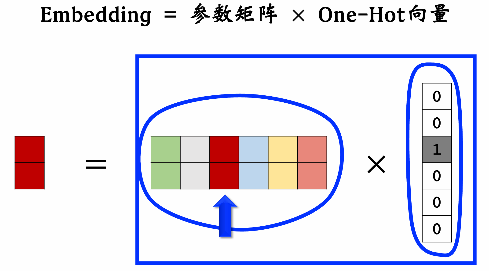

## 8. 召回：矩阵补充；最近邻查

#### 8.1. 矩阵补充的模型结构

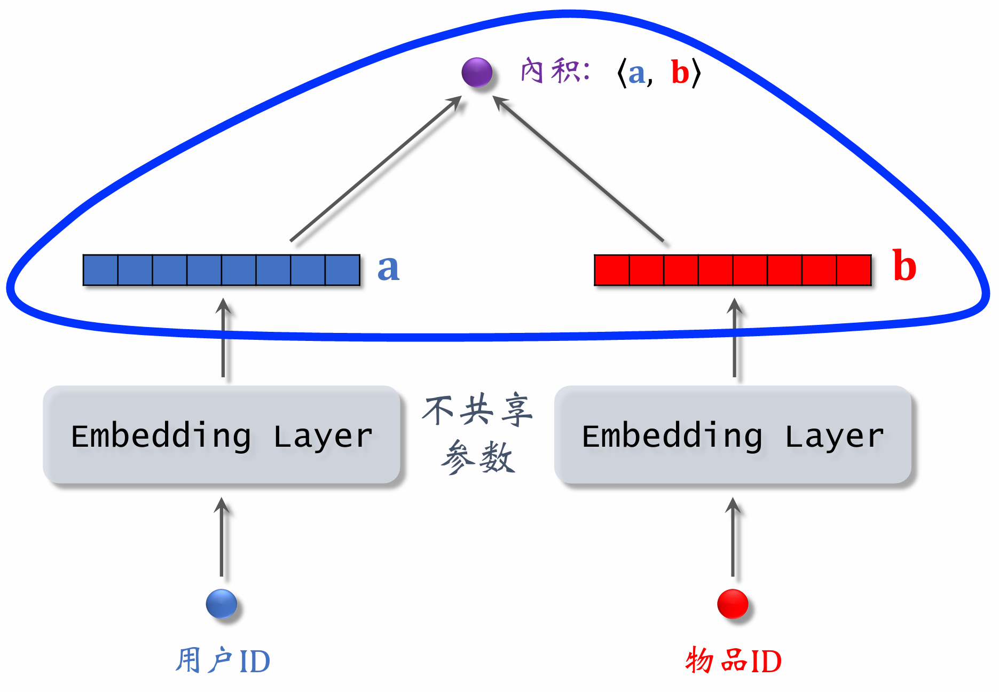
Embedding Layer 是一个矩阵，矩阵中的每一列是对应的向量，把用户 ID，物品 ID 分别通过 Embedding Layer 得到对应向量，最后对向量做内积

#### 8.2. 矩阵补充的模型训练

- ⽤户 embedding 参数矩阵记作$A$。第$u$号⽤户对应矩阵第$u$列，记作向量$a_u$
- 物品 embedding 参数矩阵记作$B$。第$i$号物品对应矩阵第$i$列，记作向量$b_i$
  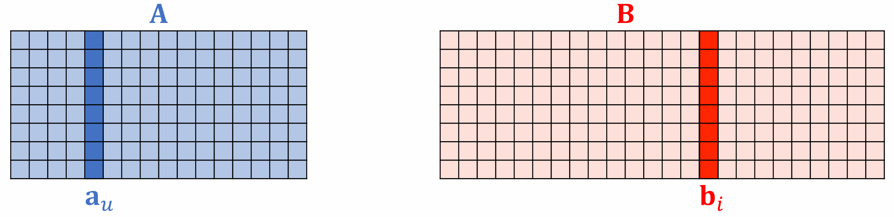
- 內积$\left\langle a_u,b_i \right\rangle$是第$u$号⽤户对第$i$号物品兴趣的预估值
- 训练模型的⽬的是学习矩阵$A$和$B$，使得预估值拟合真实观测的兴趣分数
- 数据集：(⽤户 ID，物品 ID，兴趣分数)的集合，记作$\Omega =\left\{(u,i,y)\right\}$
- 数据集中的兴趣分数是系统记录的，⽐如：
  - 曝光但是没有点击->0 分
  - 点击、点赞、收藏、转发->各算 1 分
  - 分数最低是 0，最⾼是 4
- 把⽤户 ID、物品 ID 映射成向量
  - 第$u$号⽤户->向量$a_u$
  - 第$i$号物品->向量$b_i$
- 求解优化问题，得到参数 A 和 B
  - $\min\limits_{A,B}\sum\limits_{(u,i,y)\in \Omega }(y-\left \langle a_u,b_i \right \rangle )^{2}$

#### 8.3. 矩阵补充名称的由来

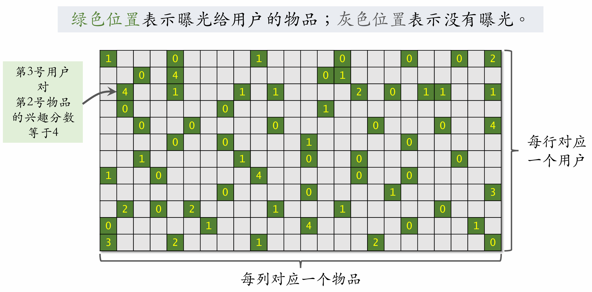
用绿色位置的数据训练模型，用训练的模型推测灰色部分的值

#### 8.4. 矩阵补充的缺点

1. 仅⽤ IDembedding，没利⽤物品、⽤户属性
   - 物品属性：类⽬、关键词、地理位置、作者信息
   - ⽤户属性：性别、年龄、地理定位、感兴趣的类⽬
   - 双塔模型可以看做矩阵补充的升级版
2. 负样本的选取⽅式不对
   - 样本：⽤户—物品的⼆元组，记作$(u,i)$
   - 正样本：曝光之后，有点击、交互。(正确的做法)
   - 负样本：曝光之后，没有点击、交互。(错误的做法)
3. 做训练的⽅法不好
   - 內积$\left \langle a_i,b_i \right \rangle$不如余弦相似度
   - ⽤平⽅损失(回归)，不如⽤交叉熵损失(分类)

#### 8.5. 矩阵补充的线上服务步骤

8.5.1. 模型存储

1. 训练得到矩阵 A 和 B
   - A 的每⼀列对应⼀个⽤户
   - B 的每⼀列对应⼀个物品
2. 把矩阵 A 的列存储到 key-value 表
   - key 是⽤户 ID，value 是 A 的⼀列
   - 给定⽤户 ID，返回⼀个向量(⽤户的 embedding)
3. 矩阵 B 的存储和索引⽐较复杂

8.5.2. 线上服务

1. 把⽤户 ID 作为 key，查询 key-value 表，得到该⽤户的向量，记作$a$
2. **最近邻查找**：查找⽤户最有可能感兴趣的 k 个物品，作为召回结果
   - 第$i$号物品的 embedding 向量记作$b_i$
   - 內积$\left \langle a_i,b_i \right \rangle$是⽤户对第$i$号物品兴趣的预估
   - 返回內积最⼤的 k 个物品
     > 如果枚举所有物品，时间复杂度正⽐于物品数量

#### 8.6. 近似最近邻查找

支持最近邻查找的数据库系统:

- 数据库系统：Milvus、Faiss、HnswLib 等等
- 衡量最近邻的标准:
  - 欧式距离最⼩(L2 距离)
  - 向量內积最⼤(內积相似度)
  - 向量夹⾓余弦最⼤(cosine 相似度)

## 9. 双塔模型：模型和训练

#### 9.1. 双塔模型的结构

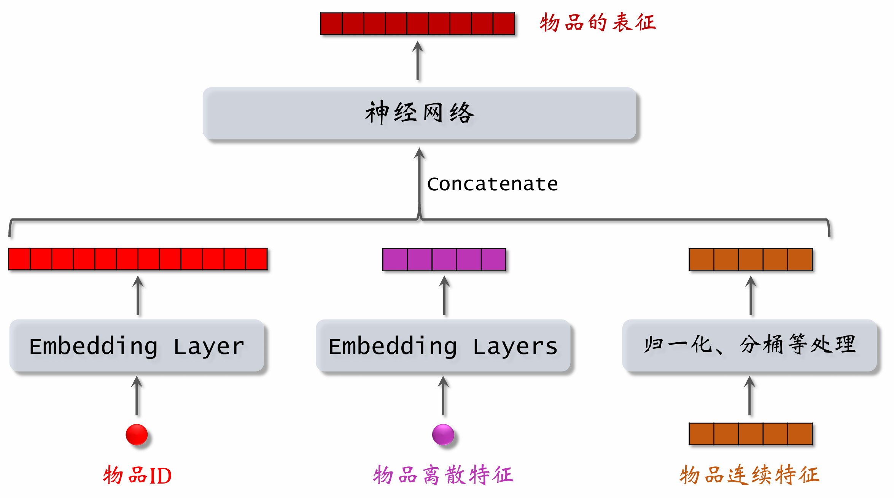
通过 Embedding 层和神经网络，将用户和物品特征转换为向量，作为表征
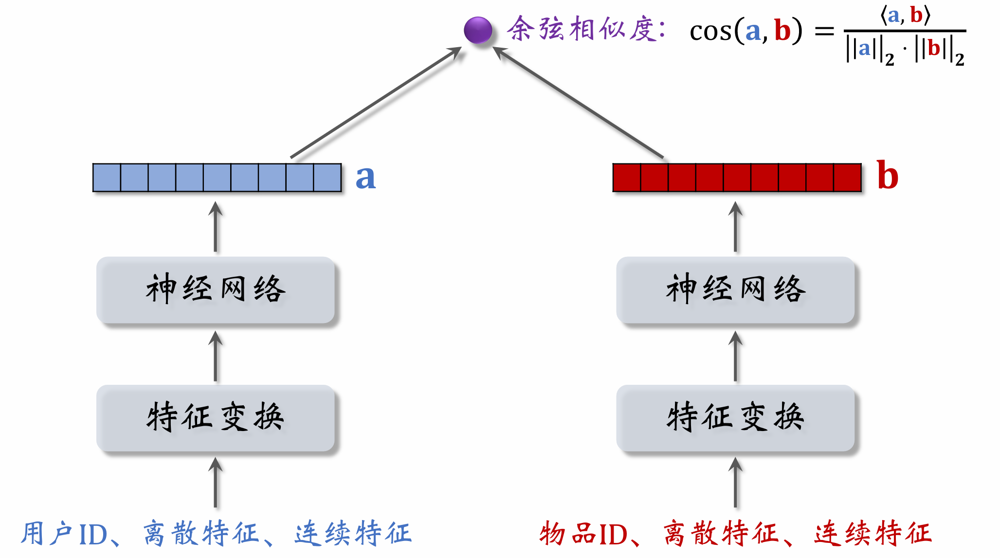
左边的塔用来提取用户的特征，右边的塔用来提取物品的特征
余弦相似度的分子是用户向量$a$与物品向量$b$的内积
分母是用户向量$a$的二范数与物品向量$b$的二范数的乘积

#### 9.2. 双塔模型的训练

1. 训练方法：
   - Pointwise：独⽴看待每个正样本、负样本，做简单的⼆元分类
   - Pairwise：每次取⼀个正样本、⼀个负样本
   - Listwise：每次取⼀个正样本、多个负样本
2. 正负样本的选择
   - 正样本：⽤户点击的物品
   - 负样本：
     - 没有被召回的
     - 召回但是被粗排、精排淘汰的
     - 曝光但是未点击的

#### 9.3. Pointwise 训练

- 把召回看做⼆元分类任务
- 对于正样本，⿎励$cos(a,b)$接近$+1$
- 对于负样本，⿎励$cos(a,b)$接近$-1$
- 控制正负样本数量为 1:2 或者 1:3

#### 9.4. Pairwise 训练

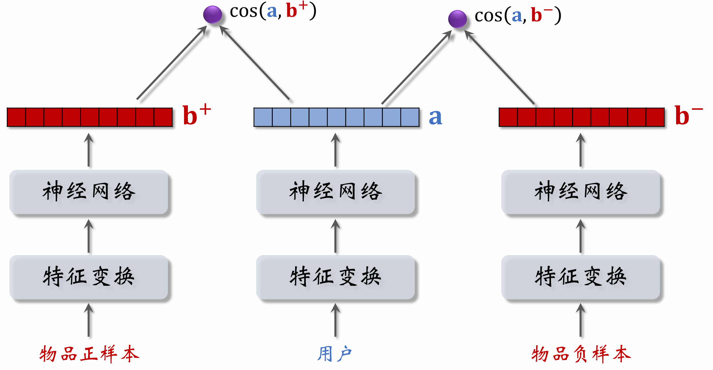
物品正样本和物品负样本所使用的神经网络、特征变换网络参数一致
基本想法：⿎励$cos(a,b^{+})$⼤于$cos(a,b^{-})$, $cos(a,b^{+})$比$cos(a,b^{-})$大的越多越好

- 如果$cos(a,b^{+})$⼤于$cos(a,b^{-})+𝑚$，则没有损失。$m$是超参数
- 否则，损失等于$cos(a,b^{-})+𝑚-cos(a,b^{+})$

损失函数：

- Triplet hinge loss:$L(a,b^{+},b^{-})=max\left \{0,cos(a,b^{-})+m-cos(a,b^{+})\right \}$
- Triplet logistic loss:$L(a,b^{+},b^{-})=\log{(1+\exp\left[\sigma \cdot(\cos(a,b^{-})-\cos(a,b^{+}))\right])}$
  > $\sigma$是一个大于 0 的超参数，手动设置

#### 9.5. Listwise 训练

1. 样本选择
   - ⼀条数据包含
     - ⼀个⽤户，特征向量记作$a$
     - ⼀个正样本，特征向量记作$b^{+}$
     - 多个负样本，特征向量记作$b_{1}^{-},\cdots,b_{n}^{-}$
   - ⿎励$cos(a,b^{+})$尽量⼤
   - ⿎励$cos(a,b_{1}^{-}),\cdots,cos(a,b_{n}^{-})$尽量⼩

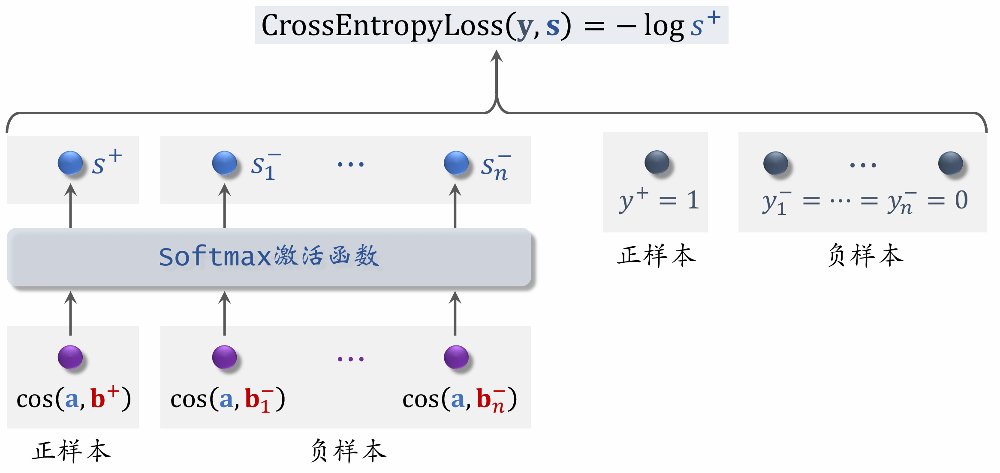

分别计算用户向量与正样本、负样本之间的余弦相似度，并将得到的结果输入 softmax 激活函数。正样本输出期望是 1，负样本输出的期望是 0。使用 CrossEntropyLoss(交叉熵)计算损失函数
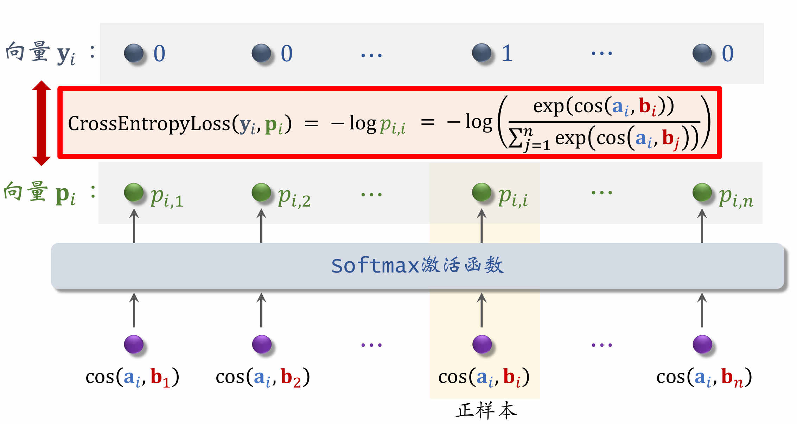

> 损失函数
> $CrossEntropyLoss(y_i,p_i)=-\log{p_{i,i}}=-\log({\frac{\exp (\cos (a_i,b_i))}{\sum\limits_{j=1}^{n}\exp (\cos (a_i,b_i))}})$

## 10. 双塔模型--正负样本

1. 正样本
   - 正样本：曝光⽽且有点击的⽤户—物品⼆元组(⽤户对物品感兴趣)
   - 问题：少部分物品占据⼤部分点击，导致正样本⼤多是热门物品
   - 解决⽅案：过采样冷门物品，或降采样热门物品
     - 过采样(up-sampling)：⼀个样本出现多次
     - 降采样(down-sampling)：⼀些样本被抛弃
2. 简单负样本：全体物品
   - 未被召回的物品，⼤概率是⽤户不感兴趣的
   - 未被召回的物品$\approx$全体物品
   - 从全体物品中做抽样，作为负样本
   - 均匀抽样：对冷门物品不公平
     - 正样本⼤多是热门物品
     - 如果均匀抽样产⽣负样本，负样本⼤多是冷门物品
   - ⾮均匀抽采样：⽬的是打压热门物品
     - 负样本抽样概率与热门程度(点击次数)正相关
     - 抽样概率$\propto$(点击次数)$^{0.75}$
3. 简单负样本：Batch 内负样本
   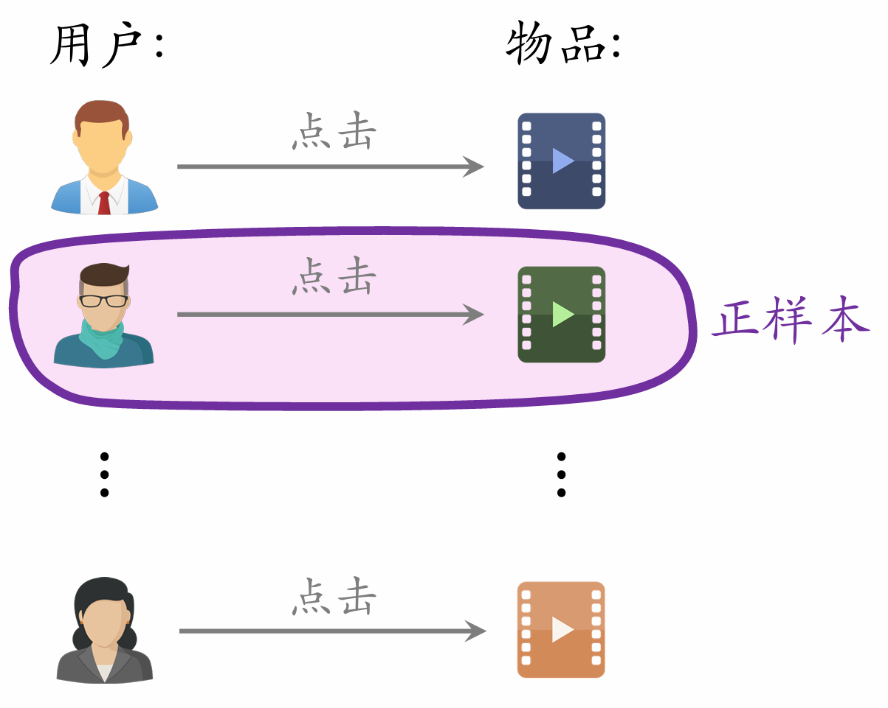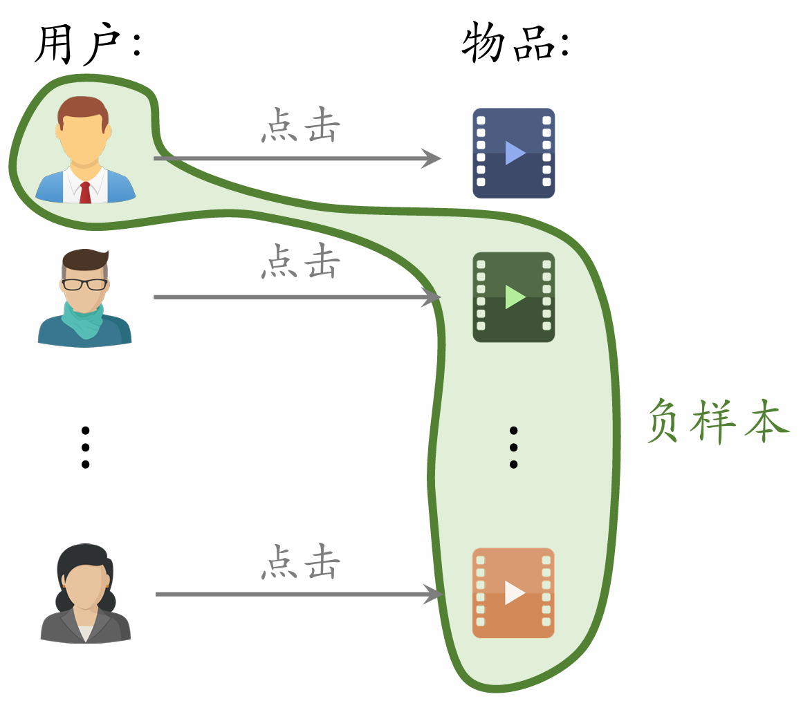
   - batch 内的用户至少点击过 batch 内的一个物品
   - ⼀个 batch 内有$n$个正样本，一个用户与其点击过的一件物品组成一个正样本
   - ⼀个⽤户和$n−1$个物品组成负样本
   - 这个 batch 内⼀共有$n(n-1)$个负样本
   - 负样本都是简单负样本(第⼀个⽤户大概率不喜欢第⼆个物品，因为对于第一个用户来说，第二个物品相当于是从全体物品中简单随机抽样的)
   - ⼀个物品出现在 batch 内的概率$\propto$点击次数
   - 物品成为负样本的概率本该是$\propto$(点击次数)$^{0.75}$，但在这⾥是$\propto$点击次数
   - 热门物品成为负样本的概率过⼤，对于热门物品的抽样打压太过了
   - 物品$i$被抽样到的概率：$p_i\propto$点击次数
   - 预估⽤户对物品$i$的兴趣：$\cos(a,b_i)$
     > $cos(a,b_i)$余弦相似度，$a$用户特征向量，$b_i$物品特征向量
   - 做训练的时候，调整为：$\cos(a,b_i)-\log{p_i}$，线上做召回时，仍用$\cos(a,b_i)$
4. 困难负样本：被排序淘汰的物品
   困难负样本包括：

   - 被粗排淘汰的物品(⽐较困难)
   - 精排分数靠后的物品(⾮常困难)

   训练双塔模型实际上是一个对正负样本的二元分类任务

   - 如果样本池是全体物品，那么是简单分类，分类准确率⾼
   - 如果样本池是被粗排淘汰的物品，容易分错，比较困难
   - 如果样本池是精排分数靠后的物品，更容易分错，⾮常困难

5. 训练数据
   - 混合⼏种不同类型的负样本(比如从全体样本中随机非均匀抽样和粗排、精排中淘汰的样本)
     - 50%的负样本是全体物品(简单负样本)
     - 50%的负样本是没通过排序的物品(困难负样本)
6. 常见错误
   训练召回模型不能⽤<u>**曝光但是没有点击的物品**</u>作为负样本
   训练排序模型会⽤<u>**曝光但是没有点击的物品**</u>作为负样本

## 11. 双塔模型--线上召回与更新

#### 11.1. 线上召回

1. 离线存储
   利用物品塔提取每个物品的特征向量**b**，把$\langle$特征向量**b**, 物品 ID$\rangle$保存到向量数据库。数据库中查找方法采用**最近邻查**
   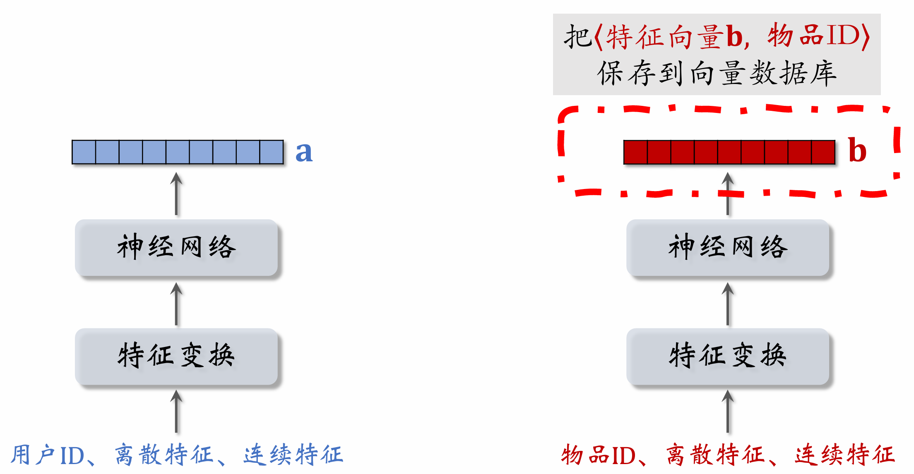
   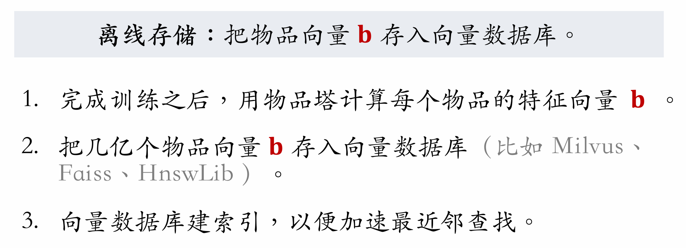
2. 线上召回
   当需要召回时，用给定的用户 ID 和特征，在线上计算用户特征向量**a**，把用户特征向量**a**作为 query，在物品向量数据库中进行最近邻查找
   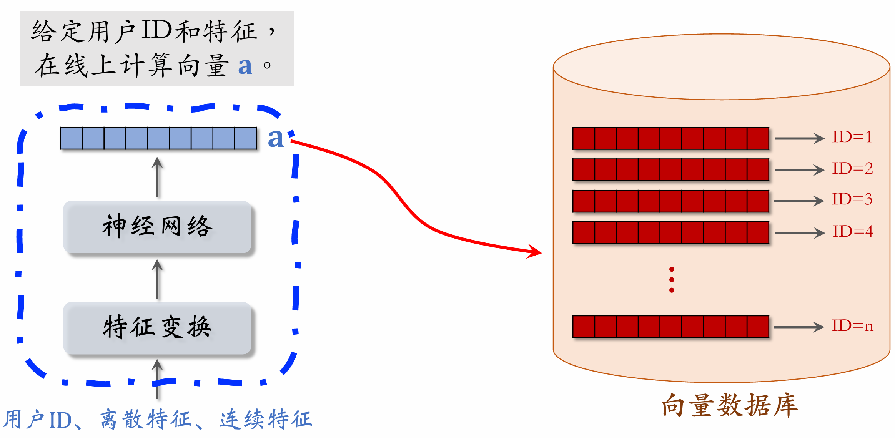
   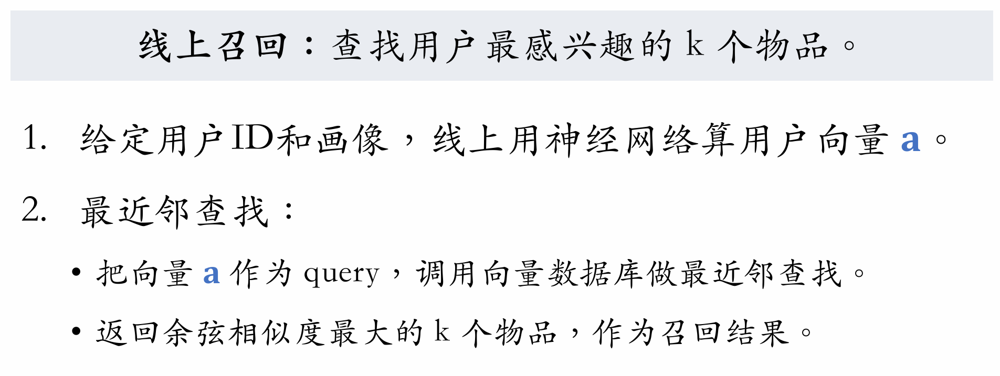

> 事先存储物品向量 b，线上现算⽤户向量 a，为什么？
>
> 1. 每做⼀次召回，⽤到⼀个⽤户向量 a，⼏亿物品向量 b。(线上算物品向量的代价过大)
> 2. ⽤户兴趣动态变化，⽽物品特征相对稳定。(可以离线存储用户向量，但不利于推荐)

#### 11.2. 模型更新

1. **全量更新**：今天凌晨，⽤昨天全天的数据训练模型
   - 在昨天模型参数的基础上做训练。(不是随机初始化)
   - ⽤昨天的数据，训练 1epoch，即每天数据只⽤⼀遍
   - 发布新的⽤户塔神经⽹络和物品向量，供线上召回使⽤
   - 全量更新对数据流、系统的要求⽐较低
2. **增量更新**：做 online learning 更新模型参数
   - ⽤户兴趣会随时发⽣变化
   - 实时收集线上数据，做流式处理，⽣成 TFRecord ⽂件
   - 对模型做 online learning，增量更新 ID Embedding 参数。(不更新神经⽹络其他部分的参数，只更新 Embedding 层参数)
   - 发布⽤户 ID Embedding，供⽤户塔在线上计算⽤户向量。
     > 用户 Embedding 层的作用是将用户和用户离散、连续特征转换为向量，作为表征

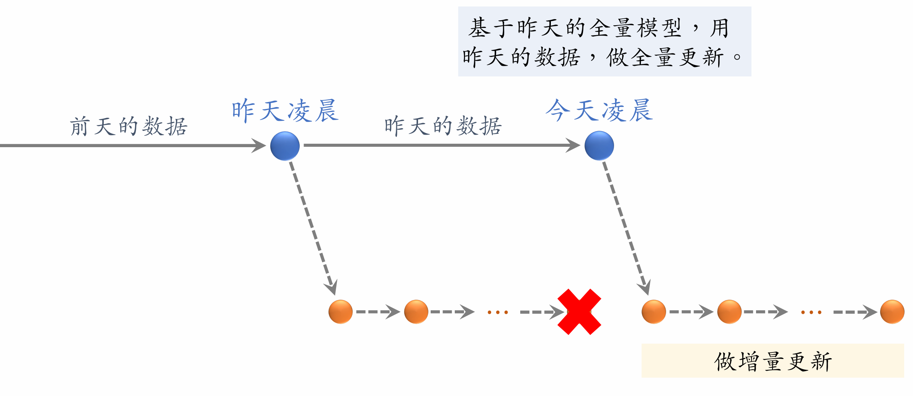

> 能否只做增量更新，不做全量更新？
>
> - ⼩时级数据有偏；分钟级数据偏差更⼤
> - 全量更新：random shuffle ⼀天的数据，做 1epoch 训练
> - 增量更新：按照数据从早到晚的顺序，做 1epoch 训练
> - 随机打乱优于按顺序排列数据，全量训练优于增量训练
> - 实际的系统是全量更新和增量更新相结合

## 12. 双塔模型+自监督学习

> 自监督学习的目的是把物品塔学习得更好

#### 12.1. 双塔模型的问题

1. 推荐系统的头部效应严重
   - 少部分物品占据⼤部分点击
   - ⼤部分物品的点击次数不⾼
2. ⾼点击物品的表征学得好，长尾物品的表征学得不好
3. ⾃监督学习：做 data augmentation，更好地学习长尾物品的向量表征。

#### 12.2. 训练双塔模型(无特征变换)

1. 从点击数据中随机抽取 n 个⽤户--物品⼆元组，组成一个 batch
2. 双塔模型的损失函数(对应用户 i)：$L_{main}[i]=-\log({\frac{\exp (\cos (a_i,b_i)-\log{p_i})}{\sum\limits_{j=1}^{n}\exp (\cos (a_i,b_j)-\log{p_j})}})$
3. 做梯度下降，减⼩损失函数：$\frac{1}{n}\sum\limits_{i=1}^{n}L_{main}[i]$

#### 12.3. 自监督学习

1. 物品$i$的特征分别通过两个不同的变换 1 和变换 2 得到物品特征$i'$和物品特征$i''$
2. 物品$j$进行同样操作，得到物品特征$j'$和物品特征$j''$
3. 将物品特征$i'$，$i''$，$j'$，$j''$分别通过物品塔，得到对应物品$i$的特征向量$b_i'$，$b_i''$，对应物品$j$的特征向量$b_j'$，$b_j''$
4. $b_i'$与$b_i''$之间应具有高余弦相似度，$b_i'$与$b_j'$和$b_j''$应具有低余弦相似度，⿎励$\cos(b_i',b_i'')$尽量⼤，$\cos(b_i',b_j'')$尽量⼩
   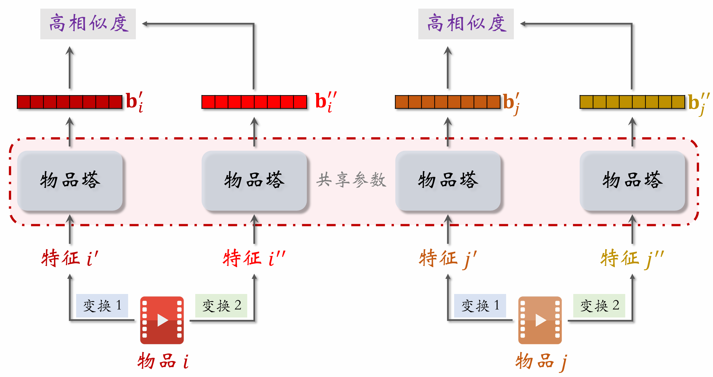
   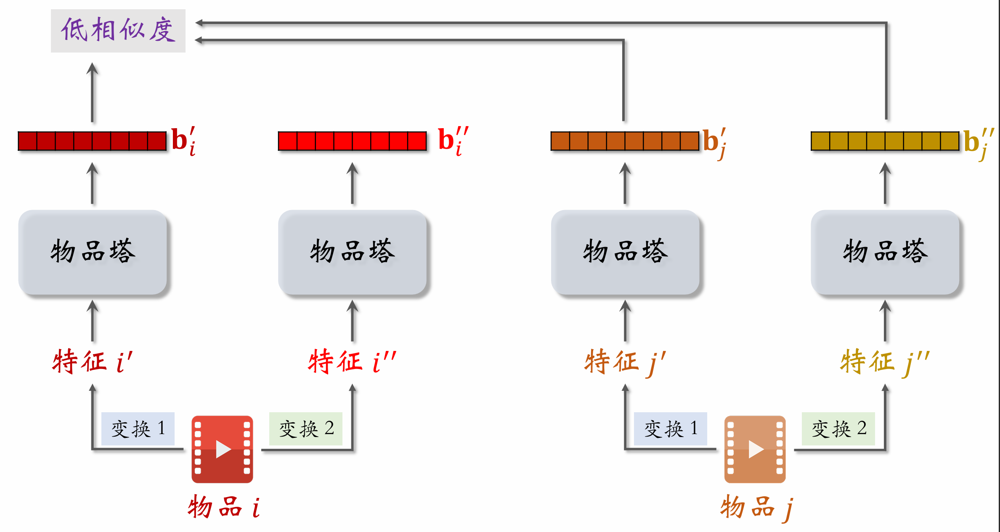

#### 12.4. 特征变换

1. Random Mask
   - 随机选⼀些离散特征(⽐如类⽬)，把它们遮住
   - 例：
     - 某物品的类⽬特征是$u$ = {数码,摄影}
     - Mask 后的类⽬特征是$u'$ = {default}
2. Dropout(仅对多值离散特征⽣效)
   - ⼀个物品可以有多个类⽬，那么类⽬是⼀个多值离散特征
   - Dropout：随机丢弃特征中 50%的值
   - 例:
     - 某物品的类⽬特征是$u$ = {美妆,摄影}
     - Dropout 后的类⽬特征是$u'$ = {美妆}
       > Random Mask 会舍弃物品某一项特征中的所有值，Dropout 会舍弃物品某一**多值离散特征**中的部分值
3. 互补特征(complementary)
   - 假设物品⼀共有 4 种特征：ID，类⽬，关键词，城市
   - 随机分成两组：{ID，关键词} 和 {类⽬，城市}
   - { ID，default，关键词，default } -> 物品表征向量 1
   - { default，类⽬，default，城市 } -> 物品表征向量 2
   - 物品表征向量 1 与物品表征向量 2 之间应相似
4. Mask ⼀组关联的特征
   > 物品中某些特征具有强关联属性，只 mask 其中一个，神经网络可能会学习到被 mask 的特征，所以将这些具有强关联属性的特征同时 mask
   - 受众性别：$u$={男,女，中性}
   - 类目：$v$={美妆,数码,⾜球,摄影,科技,⋯}
   - $u$=⼥和$v$=美妆同时出现的概率$p(u,v)$⼤
   - $u$=⼥和$v$=数码同时出现的概率$p(u,v)$小
   - $p(u)$：某特征取值为$u$的概率
     - $p$(男性) = $20\%$
     - $p$(女性) = $30\%$
     - $p$(中性) = $50\%$
   - $p(u,v)$：某特征取值为$u$，另⼀个特征取值为$v$，同时发⽣的概率
     - $p$(⼥性，美妆) = $3\%$
     - $p$(⼥性，美妆) = $0.1\%$
   - 离线计算特征两两之间的关联，⽤互信息(mutual information)衡量：$MI(u,v)=\sum\limits_{u\in U} \sum\limits_{v\in V}p(u,v)\cdot \log{\frac{p(u,v)}{p(u)\cdot p(v)}}$
     > 两个特征的关联越强，mutual information 就越大
   - 设⼀共有$k$种特征。离线计算特征两两之间$MI$,得到$k\times k$的矩阵
   - 随机选⼀个特征作为种⼦，找到种⼦最相关的$k/2$种特征
   - Mask 种⼦及其相关的$k/2$种特征，保留其余的$k/2$种特征
     > 好处：⽐ randommask、dropout、互补特征等⽅法效果更好
     > 坏处：⽅法复杂，实现的难度⼤，不容易维护

#### 12.5. 训练有特征变换的模型(自监督模型)

1. 从全体物品中均匀抽样，得到$m$个物品，作为⼀个 batch
   > 双塔模型是根据点击行为进行抽样，热门物品被抽样概率大
   > 自监督模型训练时，直接从全体物品中抽样，冷门和热门物品抽样概率相同，自监督模型只训练物品塔
2. 做两类特征变换，物品塔输出两组向量：$b_1',b_2',\cdots,b_m'$和$b_1'',b_2'',\cdots,b_m''$
3. 第 i 个物品的损失函数：$L_{self}[i]=-\log{(\frac{\exp(\cos(b_i',b_i''))}{\sum\limits_{j=1}^{m}\exp(\cos(b_i',b_j''))})}$
   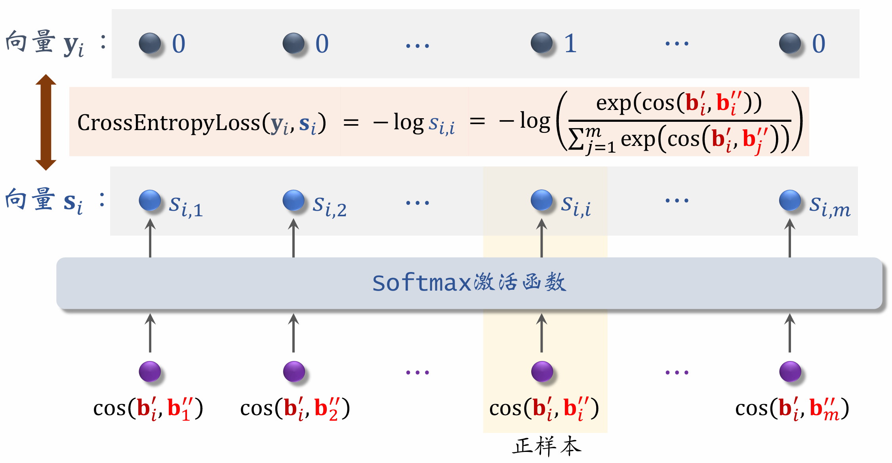
4. 做梯度下降，减⼩⾃监督学习的损失：$\frac{1}{m}\sum\limits_{i=1}^{m}L_{self}[i]$

#### 12.6. 现实流程

1. 对点击做随机抽样，得到$n$对⽤户--物品⼆元组，作为一个 batch，训练双塔模型
2. 从全体物品中均匀抽样，得到$m$个物品，作为⼀个 batch，训练自监督学习模型
3. 做梯度下降，使得损失减⼩：$\frac{1}{n}\sum\limits_{i=1}^{n}L_{main}[i]+\alpha \cdot \frac{1}{m}\sum\limits_{j=1}^{m}L_{self}[j]$
   > $L_{main}$是双塔模型的损失，$L_{self}$是自监督学习的损失，$\alpha$是一个超参数，决定自监督学习模型能起到多大作用

## 13. Deep Retrieval

1. 经典的双塔模型把⽤户、物品表⽰为向量，线上做最近邻查找
2. Deep Retrieval 把物品表征为路径(path)，线上查找⽤户最匹配的路径
3. Deep Retrieval 类似于阿⾥的 TDM

#### 13.1. 索引

1. 把⼀个物品表⽰为⼀条路径(path)，比如[2，4，1]
2. 一个物品可以表示为多条路径，比如{[2,4,1],[4,1,1]}
   > 举例：深度:depth = 3，宽度:width = K，可能的物品路径如下图所示
   > 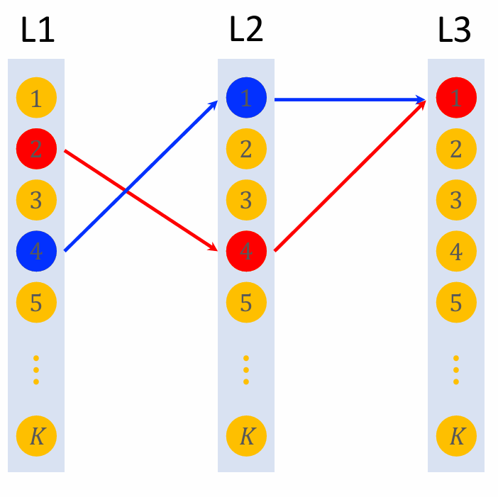
3. 物品到路径的索引 item->List$\langle$path$\rangle$
   - ⼀个物品对应多条路径
   - 当⽤ 3 个节点表⽰⼀条路径时：path= [a，b，c]
4. 路径到物品的索引 path->List$\langle$item$\rangle$
   - ⼀条路径对应多个物品

#### 13.2. 预估模型

1. ⽤ 3 个节点表⽰⼀条路径：path=[a,b,c]
2. 给定⽤户特征 x，预估⽤户对节点 a 的兴趣$p_1(a|x)$
3. 给定 x 和 a，预估⽤户对节点 b 的兴趣$p_2(b|a;x)$
4. 给定 x,a,b，预估⽤户对节点 c 的兴趣$p_3(c|a,b;x)$
5. 预估⽤户对 path=[a,b,c]兴趣：$p(a,b,c|x)=p_1(a|x)\times p_2(b|a;x)\times p_3(c|a,b;x)$

#### 13.2.1. 预估模型的具体执行过程

1. 假设 Deep Retrieval 结构有 3 层，每层有 k 个结点，则路径长度为 3，路径中每个结点有 k 种可能性
2. 提取用户特征向量 x,输入神经网络 1，由 Softmax 层输出一个向量$p_1$
3. $p_1$对应 Deep Retrieval 结构的第一层，是一个 K 维向量，向量中每一个元素是对 Deep Retrieval 结构对应层别结点的打分
4. 使用 beam search 方法，选出一个结点，记为 a，并进行 embedding，得到向量 emb(a)
5. 将用户特征向量 x 和向量 emb(a)进行向量拼接(Concatenation)操作，输入神经网络 2，得到对下一层的打分向量$p_2$
6. 以此类推，使用 beam search 方法，选出一个结点，记为 b，进行 embedding，得到向量 emb(b)
7. 将用户特征向量 x ，向量 emb(a)和向量 emb(b)进行向量拼接操作，输入神经网络 3，得到下一层别的打分向量$p_3$，并使用 beam search 方法，选出一个结点 c
8. 路径[a,b,c]即为预估路径

### 13.3. 线上召回

召回：⽤户->路径->物品

1. 第⼀步：给定⽤户特征，⽤ beam search 召回⼀批路径
2. 第⼆步：利⽤索引“path->List$\langle$item$\rangle$”，召回⼀批物品
3. 第三步：召回的物品可能会超过对召回通道的配额限制，所以对物品做打分和排序，选出⼀个⼦集，这一步可以使用双塔模型或者其他模型

### 13.3.1 使用 Beam Search 召回一批路径

1. 假设有 3 层，每层$K$个节点，那么⼀共有$K$条路径
2. ⽤神经⽹络给所有$K^3$条路径打分，计算量太⼤
3. ⽤ beam search，可以减⼩计算量，需要设置超参数 beam size
4. 用户对 path=[a,b,c]兴趣：$p(a,b,c|x)=p_1(a|x)\times p_2(b|a;x)\times p_3(c|a,b;x)$
5. 最优路径：$[a^{*},b^{*},c^{*}]=\genfrac{}{}{0pt}{}{\arg \max}{\scriptsize{a,b,c}} p(a,b,c|x)$
6. Beam Search 实质为贪心算法，当 beam size=1 时选中的路径[a,b,c]未必是最优的路径
7. beam size 比较小时，计算量比较小，但结果不准确，beam size 比较大时，计算量比较大，但结果准确

举例：当 beam size = 4，Deep Retrieval 结构有 3 层，每一层有 K 个结点时：

1. 根据预估模型得到的对第一层的打分向量$p_1$，向量$p_1$中的元素$p_1(1|x),p_1(2|x),\cdots,p_1(K|x)$分别是对第一层对应结点的打分，选出最高的 beam size 个，此时为 4

2. 由第一层得到 4 个结点，每个结点引出到下一层每个结点一条路径，根据预估模型得到的对第一层的打分向量$p_2$
3. 对于每个被选中的节点 a，计算⽤户对路径[a,b]的兴趣：$p_1(a|x)\times p_2(b|a;x)$
4. 算出$4\times K$个分数，每个分数对应⼀条路径，选出分数 top 4 路径。
5. 后续层别以此类推，每次只筛选出分数最高的 4 条路径

### 13.3.2 离线训练

> 同时学习神经⽹络参数和物品表征

- 训练目标 1：神经⽹络$p(a,b,c|x)$的参数，神经⽹络$p(a,b,c|x)$预估⽤户对路径$[a,b,c]$的兴趣
- 训练目标 2：物品的表征，把⼀个物品表征为多条路径${[a,b,c]}$建⽴索引:
  - item->List$\langle$path$\rangle$
  - path->List$\langle$item$\rangle$
- 训练时只需要正样本。正样本(user, item)： click(user, item) = 1

**1. 学习神经网络参数**

- 假设物品表征为$J$条路径：$[a_1,b_1,c_1],\cdots,[a_J,b_J,c_J]$
- 用户对路径$[a,b,c]$的兴趣：$p(a,b,c|x)=p_1(a|x)\times p_2(b|a;x)\times p_3(c|a,b;x)$
- 如果用户点击过物品，说明用户对$J$条路径感兴趣
- 应该让$\sum\limits_{j=1}^{J}p(a_j,b_j,c_j|x)$变大
- 损失函数 loss = -log($\sum\limits_{j=1}^{J}p(a_j,b_j,c_j|x)$)

**2. 学习物品表征**

- 用户 user 对路径 path=[a,b,c]的兴趣记作：$p(path|user)=p(a,b,c|x)$
- 物品 item 与路径 path 的相关性：$score(item,path)=\sum\limits_{user}p(path|user)\times click(user,item)$
  > p(path|user)表示用户对路径的兴趣 click(user,item)表示是否点击(0 或 1)
  > 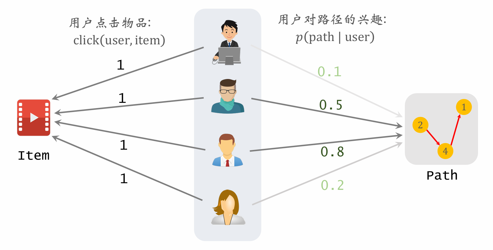
  > 图片左侧是物品，中间是用户，右边是神经网络计算出来的路径，每一个用户都点击过物品，可看作正样本
  > 计算$score(item,path)=\sum\limits_{user}p(path|user)\times click(user,item)$，如果得分高，则认为这条路径和这件物品相关性很高，便把这条路径作为物品的表征
- 根据 score(item,path)选出$J$条路径$\Pi = \{path_1,\cdots,path_J \}$作为 item 的表征
- 损失函数(选择与 item 高度相关的 path)：$loss(item,\Pi) = -\log(\sum\limits_{j=1}^Jscore(item,path_j))$
- 正则项(避免过多的 item 集中在一条 path 上)：$reg(path_j)=(number\ of\ items\ on\ path_j)^4$

**3. ⽤贪⼼算法更新路径**

- 假设已经把物品表征为$J$条路径$\Pi = \{path_1,\cdots,path_J \}$
- 每次固定$\{path_i\}_{i\neq l}$，并从未被选中的路径中，选出一条作为新的$path_l$：$path_l\gets argmin_{path_l}loss(item,\Pi)+\alpha \cdot reg(path_l)$
- 选中的路径有较⾼的分数$score(item,path_l)$，⽽且路径上的物品数量不会太多。

**4. 训练**

1. 更新神经⽹络
   - 神经⽹络判断⽤户对路径的兴趣：p(path|X)
   - 训练所需的数据：(1)“物品->路径”的索引;(2)用户点击过的物品
   - 如果⽤户点击过物品，且物品对应路径 path，则更新神经⽹络参数使 p(path|X)变⼤
2. 更新物品的表征
   - 判断物品与路径的相关性：
     | 物品 ⟵| ⽤户 | ⟶ 路径 |
     | -: | -| :- |
     | 用户点击过物品 | | 神经网络的打分 |
   - 让每个物品关联$J$条路径
     - 物品和路径要有很⾼的相关性
     - ⼀条路径上不能有过多的物品

## 14. 地理位置召回、作者召回、缓存召回

### 14.1 地理位置召回

1. GeoHash 召回
   - ⽤户可能对附近发⽣的事感兴趣
   - GeoHash：对经纬度的编码，地图上⼀个长⽅形区域
   - 索引：GeoHash->优质笔记列表(按时间倒排)
   - 这条召回通道没有个性化
     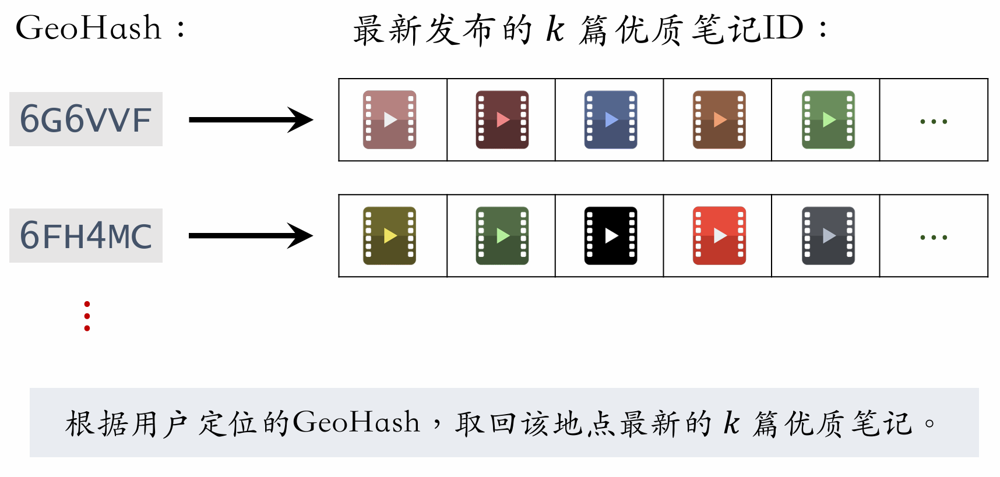
2. 同城召回
   - ⽤户可能对同城发⽣的事感兴趣
   - 索引：城市->优质笔记列表(按时间倒排)
   - 这条召回通道没有个性化

### 14.2 作者召回

1. 关注作者召回
   - ⽤户对关注的作者发布的笔记感兴趣
   - 索引:
     - ⽤户 -> 关注的作者
     - 作者 -> 发布的笔记
   - 召回：⽤户 -> 关注的作者 -> 最新的笔记
2. 有交互的作者召回
   - 如果⽤户对某笔记感兴趣(点赞、收藏、转发)，那么⽤户可能对该作者的其他笔记感兴趣
   - 索引：⽤户 -> 有交互的作者
   - 召回：⽤户 -> 有交互的作者 -> 最新的笔记
3. 相似作者召回
   - 如果⽤户喜欢某作者，那么⽤户喜欢相似的作者
   - 索引：作者 -> 相似作者($k$个作者)
   - 召回：⽤户 -> 感兴趣的作者($n$个作者) -> 相似作者($nk$个作者) ->最新的笔记($nk$篇笔记)

### 14.3 缓存召回

想法：复⽤前 n 次推荐精排的结果

- 背景:
  - 精排输出⼏百篇笔记，送⼊重排
  - 重排做多样性抽样，选出⼏⼗篇
  - 精排结果⼀⼤半没有曝光，被浪费
- 精排前 50，但是没有曝光的，缓存起来，作为一条召回通道
  > 缓存⼤⼩固定，需要退场机制
- ⼀旦笔记成功曝光，就从缓存退场
- 如果超出缓存⼤⼩，就移除最先进⼊缓存的笔记
- 笔记最多被召回 10 次，达到 10 次就退场
- 每篇笔记最多保存 3 天，达到 3 天就退场

## 15. 曝光过滤 & Bloom Filter

### 15.1 曝光过滤问题

- 如果⽤户看过某个物品，则不再把该物品曝光给该⽤户
- 对于每个⽤户，记录已经曝光给他的物品。(⼩红书只召回 1 个月以内的笔记，因此只需要记录每个⽤户最近 1 个月的曝光历史。)
- 对于每个召回的物品，判断它是否已经给该⽤户曝光过，排除掉曾经曝光过的物品
- ⼀位⽤户看过$n$个物品，本次召回$r$个物品，如果暴⼒对⽐，需要$O(nr)$的时间

### 15.2 Bloom Filter

- Bloom filter 判断⼀个物品 ID 是否在已曝光的物品集合中
- 如果判断为 no，那么该物品⼀定不在集合中
- 如果判断为 yes，那么该物品很可能在集合中。(可能误伤，错误判断未曝光物品为已曝光，将其过滤掉。)
- Bloom filter 是一种数据结构，把物品集合表征为⼀个 m 维⼆进制向量，该向量中，每一个元素占一个 bit，取值为 1 或 0
- 每个⽤户有⼀个曝光物品的集合，表征为⼀个向量，需要 m bit 的存储
- Bloom filter 有 k 个哈希函数，每个哈希函数把物品 ID 映射成介于 0 和 m−1 之间的整数

**15.2.1. k=1 时**
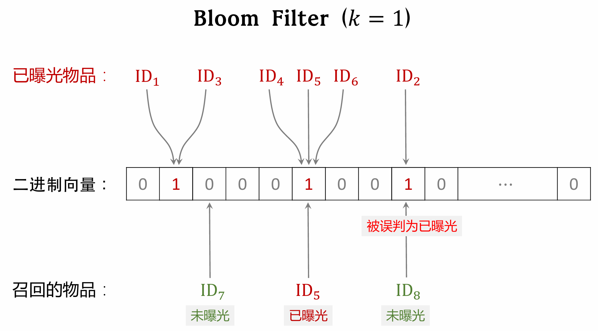

- 使用 1 个哈希函数，将物品映射到向量中，向量初始值全部赋值为 0
- 如果一个物品已曝光，则向量中对应位置赋值为 1，不同的物品可以映射到向量的同一个位置
- 召回的物品使用这个哈希函数，得到的值如果是 0，则表明一定未曝光，如果是 1，可能已曝光或未曝光

**15.2.2. k=3 时**

- 使用 3 个不同的哈希函数，将物品映射到向量中，向量初始值全部赋值为 0
- 如果一个物品已曝光，则使用这 3 个哈希函数得到的向量中的 3 个位置赋值为 1，不同的物品可以映射到向量的同一个位置
- 召回的物品使用这 3 个哈希函数，得到的值如果有一个是 0，则表明一定未曝光，如果都是 1，可能已曝光或未曝光

### 15.3 Bloom Filter 误伤的概率

- 曝光物品集合⼤⼩为$n$，⼆进制向量维度为$m$，使⽤$k$个哈希函数
- Bloom Filter 误伤的概率为$\delta \approx (1-\exp (-\frac{kn}{m}))^k$
  - $n$越⼤，向量中的 1 越多，误伤概率越⼤(未曝光物品的$k$个位置恰好都是 1 的概率大)
  - $m$越⼤，向量越长，越不容易发⽣哈希碰撞
  - $k$太⼤、太⼩都不好，$k$有最优取值
- 设定可容忍的误伤概率为$\delta$，那么最优参数为$k=1.44\cdot \ln{\frac{1}{\delta}}$，$m=2n\cdot \ln{\frac{1}{\delta}}$

### 15.4 曝光过滤的链路

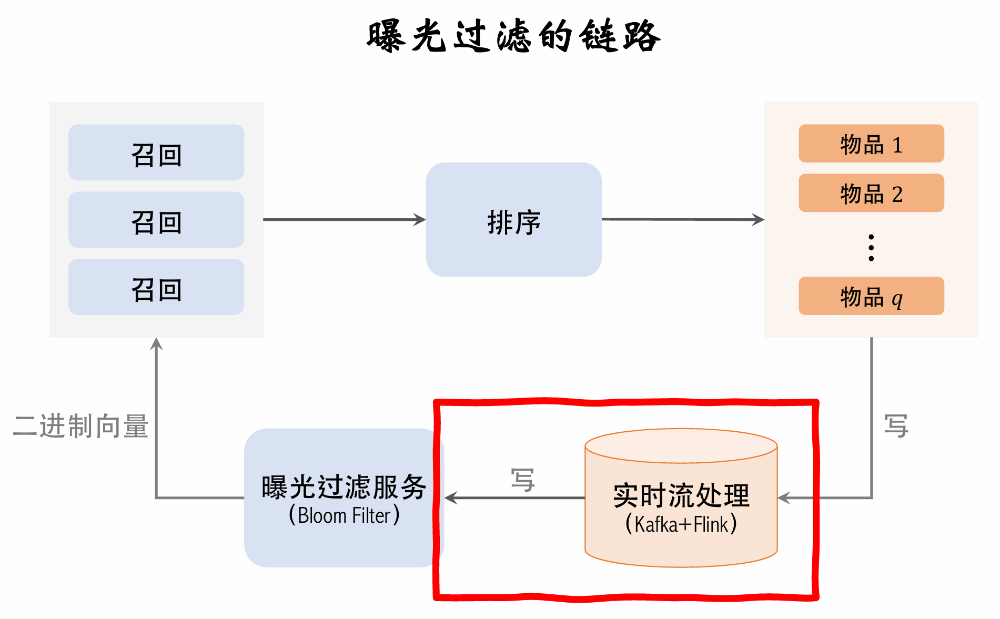

1.  **推荐**：推荐系统使用不同的召回通道，召回物品，并通过粗排、精排、重排，将一部分物品推荐给用户
2.  **曝光过滤**：推荐给用户的这部分物品，使用实时流处理(Kafka+Flink)，将物品写入 Kafka 对话序列，然后使用 Bloom Filter 处理，修改向量。
    > 这一步处理的速度必须非常快，否则在用户快速连续刷新的情况下，系统可能会给用户推荐重复物品
3.  **推荐**：在召回完成之后，系统调用曝光过滤服务，将已曝光的物品剔除，剩下的物品再进入排序

### 15.5 Bloom Filter 的缺点

- Bloom filter 把物品的集合表⽰成⼀个⼆进制向量
- 每往集合中添加⼀个物品，只需要把向量$k$个位置的元素置为 1(如果原本就是 1，则不变)
- Bloom filter 只⽀持添加物品，不⽀持删除物品。从集合中移除物品，无法消除它对向量的影响
- 每天都需要从物品集合中移除年龄⼤于 1 个⽉的物品(超龄物品不可能被召回，没必要把它们记录在 Bloom filter，降低$n$可以降低误伤率)

## 16. 排序：多目标排序模型

### 16.1 排序的依据

- 排序模型预估点击率、点赞率、收藏率、转发率等多种分数
- 融合这些预估分数(⽐如加权和)
- 根据融合的分数做排序、截断

### 16.2 多目标模型

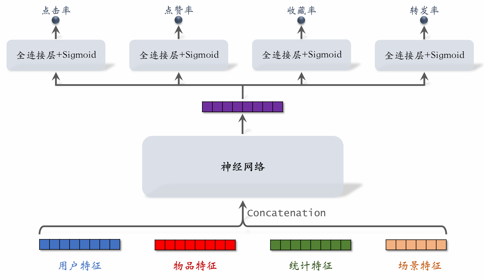
把用户特征、物品特征、统计特征、场景特征等特征向量进行向量拼接后(Concatenation)输入神经网络，神经网络输出一个向量，再把这个向量输入四个不同的全连接层+Sigmod 层，分别给出用户对物品的点击率$p_1$、点赞率$p_2$、收藏率$p_3$和转发率$p_4$的预测

- 目标值$y_1,y_2,y_3,y_4$取值为 1 或者 0，预测值为 0 到 1 之间的实数
- $CrossEntropy(y_1,p_1)=-(y_1\cdot \ln{p_1+(1-y_1)\cdot \ln{(1-p_1))}}$
- 总的损失函数$\sum\limits_{i=1}^{4} \alpha_i\cdot CrossEntropy(y_i,p_i)$
- 对损失函数求梯度，做梯度下降更新参数

### 16.3 训练存在的问题

- 困难：类别不平衡
  - 每 100 次曝光，约有 10 次点击、90 次无点击
  - 每 100 次点击，约有 10 次收藏、90 次无收藏
- 解决⽅案：负样本降采样(down-sampling)
  - 保留⼀⼩部分负样本
  - 让正负样本数量平衡，节约计算

### 16.4 预估值校准

- 正样本、负样本数量为$n_+$和$n_-$
- 对负样本做降采样，抛弃⼀部分负样本
- 使⽤$\alpha\cdot n_-$个负样本，$\alpha\in(0,1)$是采样率
- 由于负样本变少，预估点击率⼤于真实点击率
- 真实点击率：$p_{true}=\frac{n_+}{n_++n_-}$(期望)
- 预估点击率：$p_{pred}=\frac{n_+}{n_++\alpha\cdot n_-}$(期望)
- 由上两个等式可得校准公式：$p_{true}=\frac{\alpha\cdot p_{pred}}{1-p_{pred}+\alpha\cdot p_{pred}}$

## 17. 排序：Multi-gate Mixture-of-Experts(MMoE)

### 17.1 流程

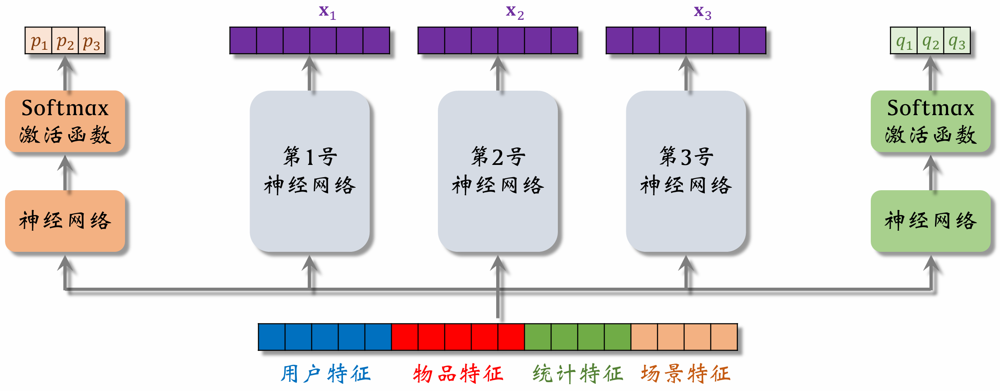

1. 将用户特征、物品特征、统计特征和场景特征进行向量拼接(Concatenation)，然后输入不同的神经网络(这里的神经网络称为专家神经网络，数量一般为 4 个或者 8 个，示例中采用 3 个)，这些神经网络的输出结果是向量。
2. 特征向量输入到另一个神经网络中，并经 softmax 层处理。输出结果是对专家神经网络的权重打分。权重向量的每一项都大于 0 小于 1，各项相加和等于 1

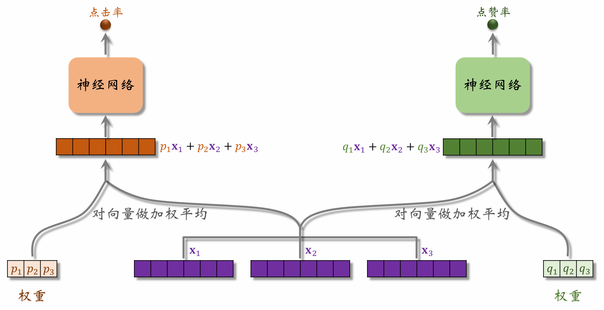

3. 使用权重向量和专家神经网络的结果进行加权计算，并把加权计算的结果输入到神经网络，神经网络的输出即是对某一消费指标的预估
4. 每一种消费指标，都需要计算一个单独的权重向量，和一个神经网络对其进行预测。

### 17.2 极化现象

**极化(polarize)**： Softmax 输出值⼀个接近 1，其余接近 0
出现极化现象会使 MMoE 模型退化为多目标模型，同时可能会出现某些专家神经网络的输出完全没有被利用上
解决极化问题：

- 如果有$n$个“专家”，那么每个 softmax 的输⼊和输出都是$n$维向量
- 在训练时，对 softmax 的输出使⽤ dropout
  - Softmax 输出的$n$个数值被 mask 的概率都是 10%
  - 每个“专家”被随机丢弃的概率都是 10%
    > 使用 dropout 后能避免极化现象的产生，因为一旦权重为 1 的专家被 mask，那么结果就会相差很大，神经网络在训练时会避免这一情况

## 18. 预估分数的融合

1. 简单的加权和
   $p_{click}+w_1\cdot p_{like}+w_2\cdot p_{collect}+\cdots$
   > $w_1，w_2$是各项权重，$p_{click}$点击的概率，$p_{like}$喜欢的概率，$p_{collect}$收藏的概率
2. 点击率乘以其他项的加权和
   $p_{click}\cdot(1+w_1\cdot p_{like}+w_2\cdot p_{collect}+\cdots)$
   > $p_{click}\cdot p_{like}$点击后再喜欢的概率
3. 海外某短视频 APP 的融分公式
   $(1+w_1\cdot p_{time})^{\alpha _1}\cdot(1+w_2\cdot p_{time})^{\alpha _2}\cdots$
   > $p_{time}$预估用户观看时长，$w_1,\alpha _1$是超参数，在做 AB 测试时进行调整
4. 国内某短视频 APP 的融分公式
   - 根据预估时长$p_{time}$，对$n$篇候选视频做排序
   - 如果某视频排名第$r_{time}$，则它得分$\frac{1}{r_{time}^\alpha+\beta}$
     > $\alpha,\beta$都是超参数
   - 对点击、点赞、转发、评论等预估分数做类似处理
   - 最终融合分数：$\frac{w_1}{r_{time}^{\alpha_1}+\beta_1}+\frac{w_2}{r_{click}^{\alpha_2}+\beta_2}+\frac{w_3}{r_{like}^{\alpha_3}+\beta_3}+\cdots$
5. 某电商的融分公式
   - 电商的转化流程：曝光->点击->加购物车->付款
   - 模型预估：$p_{click},p_{cart},p_{pay}$
   - 最终融合分数：$p_{click}^{\alpha_1}\times p_{cart}^{\alpha_2}\times p_{pay}^{\alpha_3}\times price^{\alpha_4}$

## 19. 视频播放建模

- 图⽂笔记排序的主要依据：点击、点赞、收藏、转发、评论······
- 视频排序的依据还有播放时长和完播
- 直接⽤回归拟合播放时长效果不好。建议⽤ YouTube 的时长建模

### 19.1 指标：视频播放时长

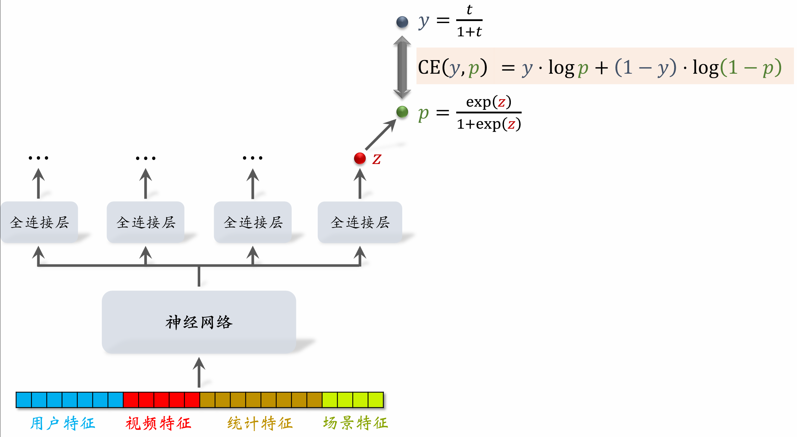

1. 将用户特征、视频特征、统计特征、场景特征输入神经网络(此神经网络被后续层别共享，shared bottom)，使用不同的全连接层输出对视频的点赞率、收藏率、播放时长等的预测，其中预测播放时长的全连接层输出$z$($z$还需经过计算处理，才能得出预测地播放时长)
2. 将$z$代入 Sigmod 函数，得到$p=\frac{\exp(z)}{1+\exp(z)}$，目标值是$y=\frac{t}{1+t}$，其中 t 是实际的观看时长
3. 损失函数(交叉熵)：$CE(y,p)=y\cdot \log{p}+(1-y)\cdot \log{(1-p)}$
4. $\exp(z)$是模型输出的对观看时长的预估，并作为融分公式中的一项，影响排序

### 19.2 指标：视频完播

1. 回归⽅法
   - 例：视频长度 10 分钟，实际播放 4 分钟，则实际播放率为 y=0.4
   - 让预估播放率$p$拟合$y$：$loss=y\cdot\log p+(1-y)\cdot\log(1-p)$
   - 线上预估完播率，模型输出 p=0.73，意思是预计播放 73%
2. ⼆元分类⽅法
   - 定义完播指标，⽐如完播 80%
   - 例：视频长度 10 分钟，播放>8 分钟作为正样本，播放<8 分钟作为负样本
   - 做二元分类训练模型：播放>80% vs 播放<80%
   - 线上预估完播率，模型输出$p$=0.73，意思是 p(播放>80%) = 0.73
     > 不能直接把预估的完播率用到融分公式，因为完播率这个指标对短视频更有利
   - 线上预估完播率，然后做调整：$p_{finish}=\frac{预估完播率}{f(视频长度)}$
     > $f(视频长度)$是有关视频时长的函数，视频时长越长，函数值越小
   - 把$p_{finish}$作为融分公式中的⼀项

## 20. 排序模型的特征

### 20.1. 用户画像(User Profile)

- ⽤户 ID(在召回、排序中做 embedding)
  > 用户 ID 通常使用 32 位或者 64 位向量进行 embedding
- 人口统计学属性：性别、年龄
- 账号信息：新⽼、活跃度·····
- 感兴趣的类目、关键词、品牌

### 20.2. 物品画像(Item Profile)

- 物品 ID(在召回、排序中做 embedding)
- 发布时间(或者年龄)
- GeoHash(经纬度编码)、所在城市
- 标题、类⽬、关键词、品牌·····
- 字数、图⽚数、视频清晰度、标签数·····
- 内容信息量、图⽚美学······
  > 内容信息量、图片美学是由算法打的分数，当物品发布后，此分数被写进物品画像中

### 20.3. 用户统计特征

- ⽤户最近 30 天(7 天、1 天、1 ⼩时)的曝光数、点击数、点赞数、收藏数·····
- 按照笔记图⽂/视频分桶(⽐如最近 7 天，该用户对图文笔记的点击率、对视频笔记的点击率)
- 按照笔记类目分桶(⽐如最近 30 天，用户对美妆笔记的点击率、对美食笔记的点击率、对科技数码笔记的点击率)

### 20.4. 笔记统计特征

- 笔记最近 30 天(7 天、1 天、1 ⼩时)的曝光数、点击数、点赞数、收藏数·····
- 按照⽤户性别分桶、按照⽤户年龄分桶·····
- 作者特征：
  - 发布笔记数
  - 粉丝数
  - 消费指标(曝光数、点击数、点赞数、收藏数)

### 20.5. 场景特征(Context)

- 用户定位 GeoHash(经纬度编码)、城市
- 当前时刻(分段，做 embedding)
- 是否是周末、是否是节假⽇
- ⼿机品牌、⼿机型号、操作系统

### 20.6. 特征处理

- 离散特征：做 embedding
  - ⽤户 ID、笔记 ID、作者 ID
  - 类目、关键词、城市、⼿机品牌
- 连续特征：做分桶，变成离散特征
  - 年龄、笔记字数、视频长度
- 连续特征：其他变换
  - 曝光数、点击数、点赞数等数值做$\log(1+x)$
  - 转化为点击率、点赞率等值，并做平滑

### 20.7. 特征覆盖率

- 很多特征无法覆盖 100% 样本
- 例：很多⽤户不填年龄，因此⽤户年龄特征的覆盖率远⼩于 100%
- 例：很多⽤户设置隐私权限，APP 不能获得用户地理定位，因此场景特征有缺失
- 提⾼特征覆盖率，可以让精排模型更准

### 20.8. 数据服务

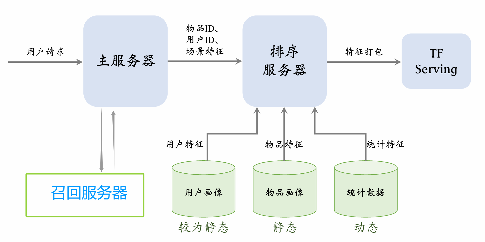

1. 当用户刷新软件时，会发送用户请求到推荐系统的主服务器上
2. 主服务器发起召回服务请求到召回服务器上，召回服务器将几十路的召回结果归并后发送回主服务器
3. 主服务器向排序服务器发送一个用户 ID，数千条物品 ID，还有当时的场景特征
4. 排序服务器分别向数据库请求用户画像、物品画像、统计数据
   > 用户画像数据库中的数据变化很小，需要很长时间才变化一次
   > 物品画像数据库中的数据变化更小，几乎可以认为是静止不动的，要求数据库读取速度快，因为每一次请求都要拉取上千条物品画像
   > 统计数据库中的数据变化很快，因为一旦用户与物品产生了互动，统计数据就会发生变化
5. 排序服务器获取到特征之后，会将特征打包后发送给 TF Serving，Tensor 会给物品打分，并将分数返回给排序服务器，排序服务器根据融合分数，多样性分数，业务规则进行排序

## 21. 粗排模型

多目标模型主要适用于精排

### 21.1. 粗排 vs 精排

- 粗排
  - 给几千篇笔记打分
  - 单次推理代价必须⼩
  - 预估的准确性不⾼
- 精排
  - 给⼏百篇笔记打分
  - 单次推理代价很⼤
  - 预估的准确性更⾼

### 21.2. 精排模型&双塔模型

1. 精排模型(多目标模型)
   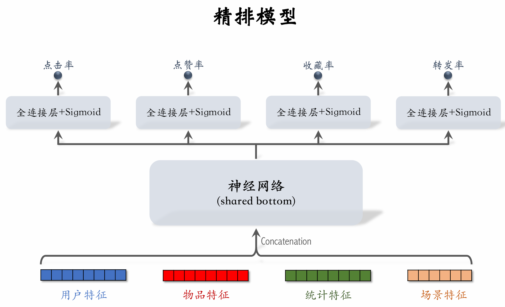
   - 前期融合：先对所有特征做向量连接(concatenation)，再输⼊神经⽹络
   - 线上推理代价大：如果有$n$篇候选笔记，整个⼤模型要做$n$次推理
2. 双塔模型(召回)
   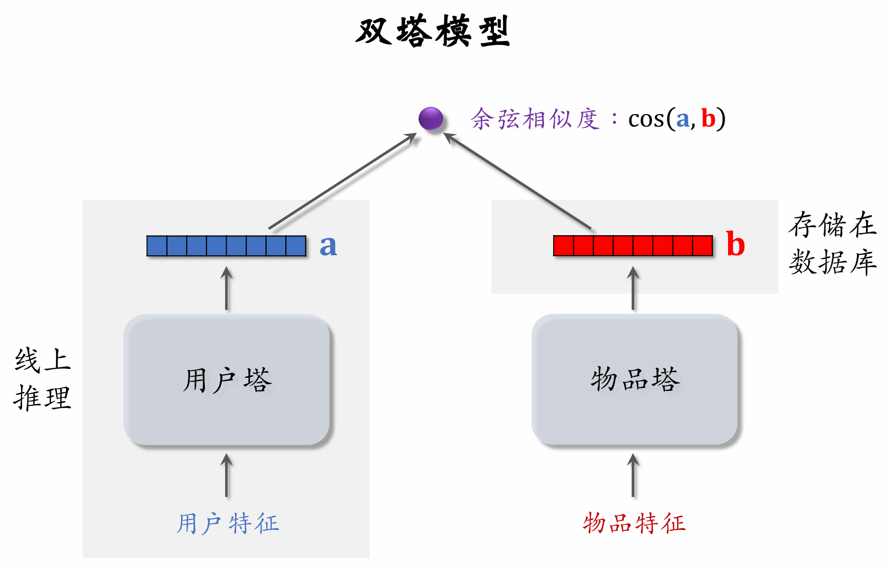
   - 后期融合：把⽤户、物品特征分别输⼊不同的神经⽹络，不对⽤户、物品特征做融合
   - 线上计算量⼩:
     - ⽤户塔只需要做⼀次线上推理，计算⽤户表征$a$
     - 物品表征$b$事先储存在向量数据库中，物品塔在线上不做推理
   - 预估准确性不如精排模型

### 21.3. 粗排的三塔模型

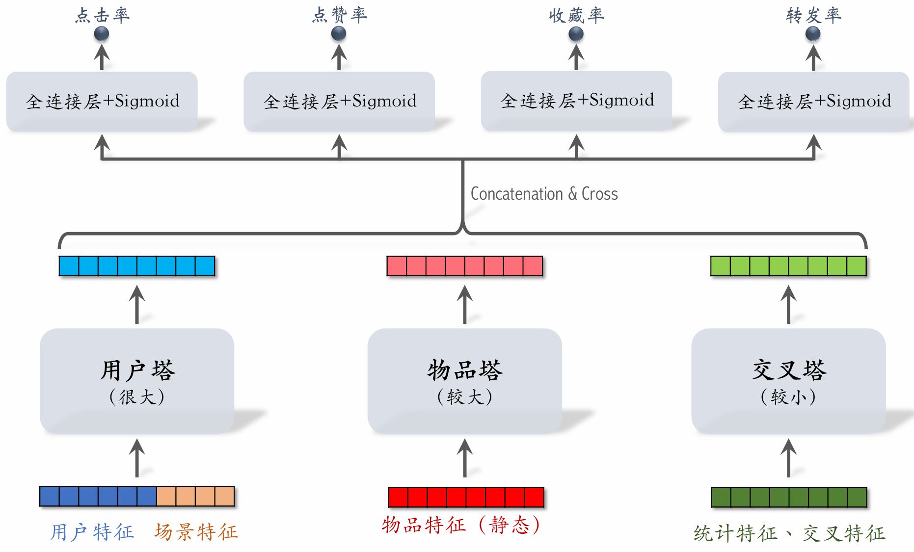

- 用户塔的输入是用户特征和场景特征
- 物品塔的输入是物品特征
- 交叉塔的输入是统计特征、交叉特征(交叉特征是用户特征和物品特征做交叉)
- 三个塔的输出向量做向量连接和交叉后，进行各个业务指标的预测

1. 用户塔
   - 只有⼀个用户，用户塔只做⼀次推理
   - 即使用户塔很⼤，总计算量也不⼤
2. 物品塔
   - 有$n$个物品，理论上物品塔需要做$n$次推理
   - 物品特征变化很小，物品塔提前缓存物品特征的输出，只需定期利用物品塔刷新缓存即可
   - PS(Parameter Server)缓存物品塔的输出向量，避免绝⼤部分推理
3. 交叉塔
   - 统计特征动态变化，缓存不可⾏
   - 有$n$个物品，交叉塔必须做$n$次推理
4. 上层结构
   - 三个塔的输出向量做向量连接和交叉后，进入上层结构进行预测
   - 有$n$个物品，模型上层需要做$n$次推理
   - 粗排推理的⼤部分计算量在模型上层

### 21.4. 三塔模型的推理

1. 从多个数据源取特征
   - 1 个⽤户的画像、统计特征
   - $n$个物品的画像、统计特征
2. ⽤户塔：只做 1 次推理
3. 物品塔：未命中缓存时需要做推理
4. 交叉塔：必须做$n$次推理
5. 上层⽹络做$n$次推理，给$n$个物品打分

## 22. 特征交叉：Factorized Machine(FM)

1. 线性模型
   - 有$d$个特征，记作$x=[x_1,x_2,\cdots,x_d]$
   - 线性模型：$p=b+\sum\limits_{i=1}^{d}w_ix_i$
     > b 是偏移项，$w_i$是权重
   - 模型有$d+1$个参数，$w=[w_1,w_2,\cdots,w_d]$和 b
   - 预测是特征的加权和(只有加，没有乘)
2. 二阶交叉特征
   - 有$d$个特征，记作$x=[x_1,x_2,\cdots,x_d]$
   - 线性模型+⼆阶交叉特征：$p=b+\sum\limits_{i=1}^{d}w_ix_i+\sum\limits_{i=1}^{d}\sum\limits_{j=i+1}^{d}u_{ij}x_ix_j$
     > $\sum\limits_{i=1}^{d}\sum\limits_{j=i+1}^{d}u_{ij}x_ix_j$是特征交叉项，$u_{ij}$是权重
   - 模型有$O(d^2)$个参数
   - 预测既使用了特征的加权和，也使用了特征的加权积
3. Factorized Machine(FM)
   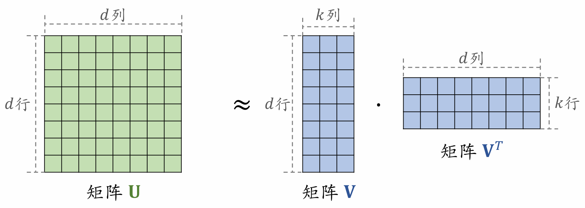

   - 将$u_{ij}$的值都提取出来，组成一个 d 行 d 列的对称矩阵
   - 此矩阵可近似等于矩阵$VV^T$，即$U\approx VV^T$，其中矩阵 V 是 d 行 k 列的矩阵，k 的值自己设置，k 越大，越精确
   - 用$VV^T$替换原矩阵中的$u_{ij}$，得到 Factorized Machine (FM)：$p=b+\sum\limits_{i=1}^{d}w_ix_i+\sum\limits_{i=1}^{d}\sum\limits_{j=i+1}^{d}(V_i^TV_j)x_ix_j$
   - FM 模型有$O(kd)$个参数($k<<d$)

> FM 是线性模型的替代品，能⽤线性回归、逻辑回归的场景，都可以⽤ FM
> FM 使⽤⼆阶交叉特征，表达能⼒⽐线性模型更强
> 通过做近似$U_{ij}\approx V_i^TV_j$，FM 把⼆阶交叉权重的数量从$O(d^2)$降低到$O(kd)$

## 23. 特征交叉：深度交叉网络(DCN)

召回、排序模型中的神经网络可以使用深度交叉网络代替

### 23.1. 交叉层(Cross Layer)

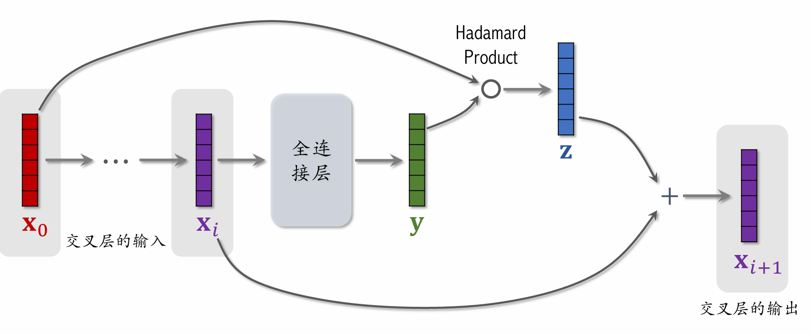

1. $x_0$是交叉层的初始输入，$x_i$是经过若干层后的输出，$x_i$经过一层全连接层后输出 y
2. 将 y 和$x_0$做 Hadamard 乘积(对应元素依次相乘)，$x_0、y、z$的维度应保持一致
3. 将$x_i、z$相加得到$x_{i+1}$，$x_{i+1}$即是交叉层的输出

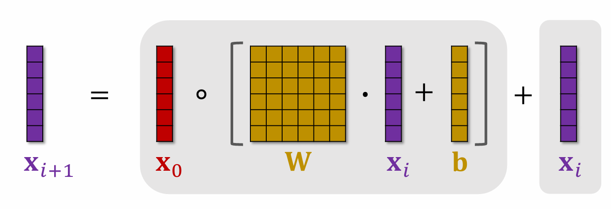

- 交叉层计算公式：$x_{i+1}=x_0\odot(w\cdot x_i+b)+x_i$
  > - $x_{i+1}$是交叉层的输出，$x_0$是初始输入，$x_i$是交叉层上一层的输出
  > - $w\cdot x_i+b$是全连接层，$w,b$是全连接层的参数
  > - $\odot$是 Hadamard 乘积的符号，表示两个矩阵对应位置相乘

### 23.2. 交叉网络(Cross Network)

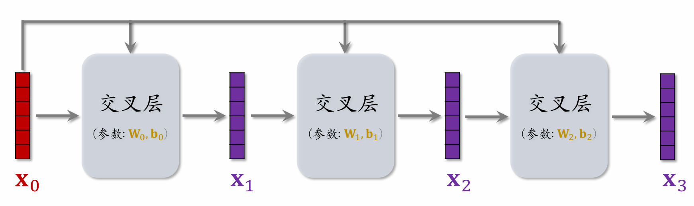

### 23.3. 深度交叉网络(Deep & Cross Network)

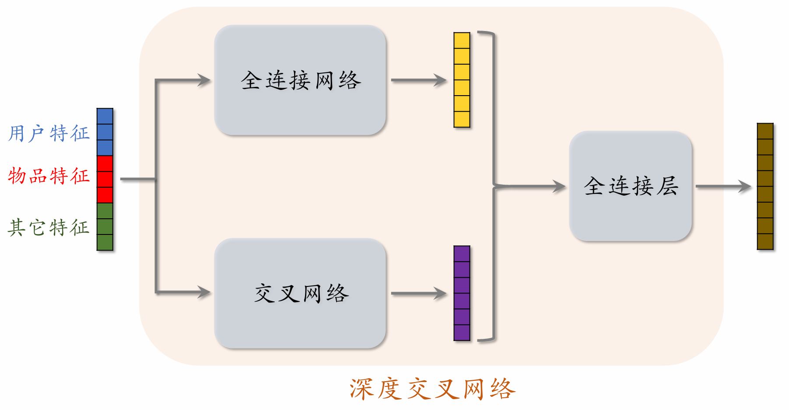
将全连接网络和交叉网络进行并联，两个网络的结果输出进行向量拼接后输入全连接层得出最终的结果

## 24. 特征交叉：LHUC 网络结构

Learning Hidden Unit Contributions (LHUC)，起源于语⾳识别，只能用于精排

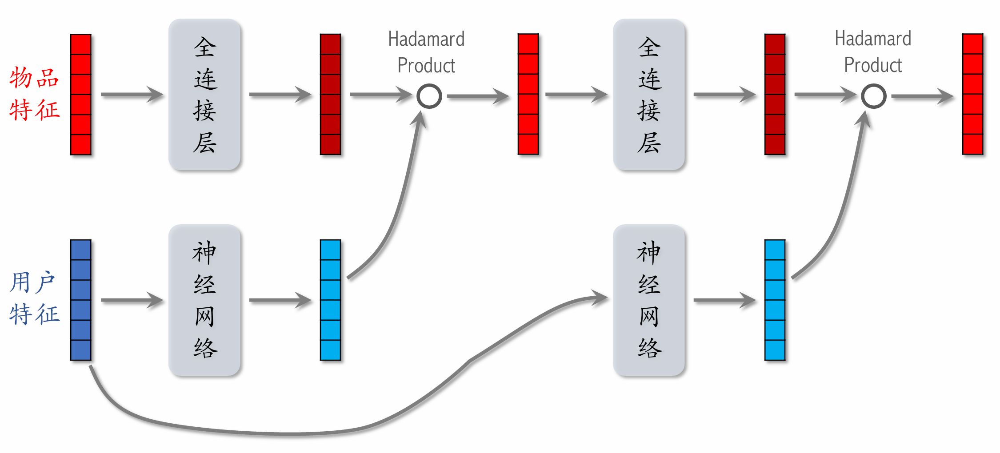

1. 将物品特征$a_0$通过一个全连接层进行处理，得到向量$a_1$
2. 将用户特征$b_0$通过一个神经网络$N_1$，该神经网络由多个全连接层和一个 2 倍的 sigmoid 层，输出结果向量$b_1$，$b_1$中的值在 0 到 2 中间
3. 将向量$a_1$和向量$b_1$进行 Hadamard 乘积处理，得到向量$a_2$
4. 将物品特征$a_2$通过一个全连接层进行处理，得到向量$a_3$
5. 将用户特征$b_0$通过一个神经网络$N_2$，该神经网络由多个全连接层和一个 2 倍的 sigmoid 层，输出结果向量$b_2$，$b_2$中的值在 0 到 2 中间
6. 将向量$a_3$和向量$b_2$进行 Hadamard 乘积处理，得到向量$a_4$，$a_4$为最终输出结果

## 25. 特征交叉：SENet & Bilinear Cross

### 25.1. SENet

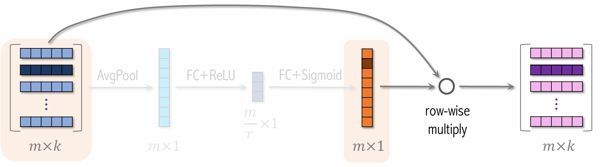

1. 把用户 ID、物品 ID、物品类目、······、物品关键词进行 Embedding 编码，提取特征向量，所有向量组成$m\times k$阶矩阵
2. 矩阵每一行做 AvgPool 池化操作，求每一行的平均值，组成一个新向量$x_1$($m$阶)
3. 向量$x_1$通过一个全连接层和 ReLU 激活函数，将向量$x_1$压缩成一个$\frac{m}{r}$维向量$x_2$
4. 向量$x_2$通过一个全连接层和 Sigmoid 激活函数，将向量$x_2$放缩成一个$m$维向量$x_3$，向量$x_3$中每一个元素都位于 0 到 1 之间
5. 权重向量$x_3$的每一位与初始矩阵对应行相乘，得到一个$m\times k$矩阵
   > 特征进行 Embedding 编码后，形成的向量维度可以不同，即初始矩阵的每一行长度可以不同

- SENet 对离散特征做 field-wise 加权
- Field：
  - 特征⽤户 ID 进行 Embedding 后是 64 维向量
  - 64 个元素算⼀个 field，获得相同的权重
- 如果有$m$个 fields，那么权重向量是$m$维

### 25.2. Field 间特征交叉

- 不同特征向量之间交叉，基础方法有内积($x_1\cdot x_2$)，哈达玛乘积($x_1\oplus x_2$)
- 内积和哈达玛乘积均要求两个向量的维度完全一致
- 向量内积的结果是一个数， m fields -> m 个实数
- 哈达玛乘积的结果是一个向量，m fields ->$m^2$个向量

1. Bilinear Cross(内积)
2. Bilinear Cross(哈达玛乘积)

### 25.3. FiBiNet

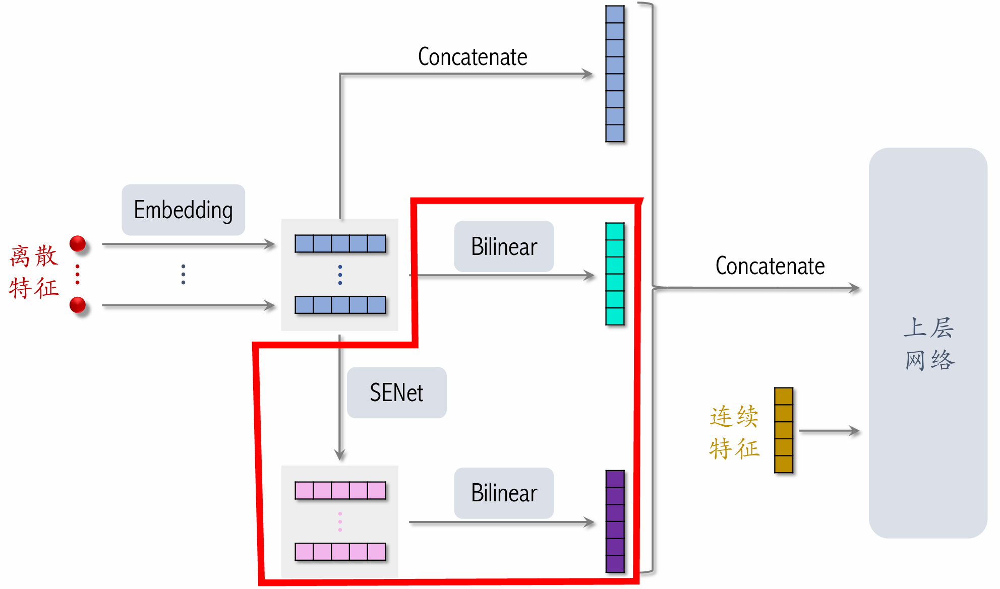

## 26. LastN：用户行为序列建模

### 26.1. LastN 特征

- **LastN**：用户最近交互过的 n 个物品
- 对 LastN 物品 ID 做 embedding，得到 n 个向量
- 把 n 个向量取平均，作为⽤户的⼀种特征
- 适⽤于召回双塔模型、粗排三塔模型、精排模型

## 27. LastN02：DIN 模型

- DIN ⽤加权平均代替平均，即注意⼒机制(attention)
- 权重：候选物品与⽤户 LastN 物品的相似度，相似度越高，权重越高
- 对于某候选物品，计算它与⽤户 LastN 物品的相似度
- 以相似度为权重，求⽤户 LastN 物品向量的加权和，结果是⼀个向量
- 把得到的向量作为⼀种⽤户特征，输⼊排序模型，预估(⽤户，候选物品)的点击率、点赞率等指标
- 本质是注意⼒机制(attention)

### 27.1. 简单平均 vs 注意力机制

- 简单平均和注意⼒机制都适⽤于精排模型
- 简单平均适⽤于双塔模型、三塔模型
  - 简单平均只需要⽤到 LastN，属于⽤户⾃⾝的特征
  - 把 LastN 向量的平均作为⽤户塔的输⼊
- 注意⼒机制不适⽤于双塔模型、三塔模型
  - 注意⼒机制需要⽤到 LastN+候选物品
  - ⽤户塔看不到候选物品，不能把注意⼒机制⽤在⽤户塔

## 28. LastN03：SIM 模型

### 28.1. DIN 模型的缺点

- 注意⼒层的计算量$\propto$ n(⽤户⾏为序列的长度)
- 只能记录最近⼏百个物品，否则计算量太⼤
- 缺点：关注短期兴趣，遗忘长期兴趣

### 28.2. 如何改进 DIN

- ⽬标：保留⽤户长期⾏为序列(𝑛 很⼤)，⽽且计算量不会过⼤
- 改进 DIN:
  - DIN 对 LastN 向量做加权平均，权重是相似度
  - 如果某 LastN 物品与候选物品差异很⼤，则权重接近零
  - 快速排除掉与候选物品无关的 LastN 物品，降低注意⼒层的计算量

### 28.3. SIM 模型

- 保留⽤户长期⾏为记录，n 的⼤⼩可以是⼏千
- 对于每个候选物品，在⽤户 LastN 记录中做快速查找，找到 k 个相似物品
- 把 LastN 变成 TopK，然后输⼊到注意⼒层
- SIM 模型减⼩计算量(从 n 降到 k)

### 28.3.1. 查找

- ⽅法⼀：Hard Search
  - 根据候选物品的类⽬，保留 LastN 物品中类⽬相同的
  - 简单，快速，无需训练
- ⽅法⼆：Soft Search
  - 把物品做 embedding，变成向量
  - 把候选物品向量作为 query，做 k 近邻查找，保留 LastN 物品中最接近的 k 个
  - 效果更好，编程实现更复杂

### 28.3.2. 注意力机制

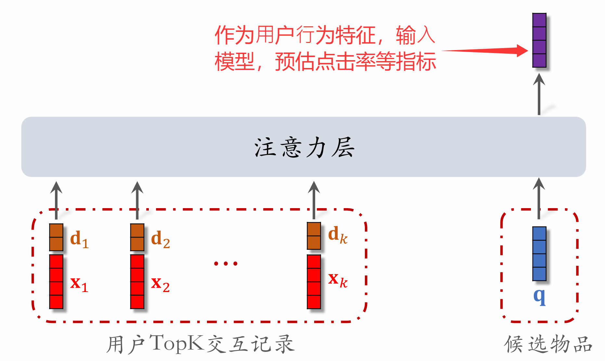

1. 从 LastN 用户行为序列中查找最接近候选物品的 k 个
2. ⽤户与某个 LastN 物品的交互时刻距今为$\delta$
3. 对$\delta$做离散化(划分时间段)，再做 embedding，变成向量 d
4. 把两个向量做 concatenation，表征⼀个 LastN 物品
   1. 向量 x 是物品的 embedding
   2. 向量 d 是时间的 embedding

### 28.4. SIM 模型使⽤时间信息

- DIN 的序列短，记录⽤户近期⾏为
- SIM 的序列长，记录⽤户长期⾏为
- 时间越久远，重要性越低
- 长序列(长期兴趣)优于短序列(近期兴趣)
- 注意⼒机制优于简单平均

## 29. 推荐系统中的多样性

### 29.1. 物品相似性的度量

1. 相似性的度量
   - 基于物品属性标签(类⽬、品牌、关键词······)
   - 基于物品向量表征
     - ⽤召回的双塔模型学到的物品向量(不好)
     - 基于内容的向量表征(好)
2. 基于物品属性标签
   - 物品属性标签：类⽬、品牌、关键词
   - 根据⼀级类⽬、⼆级类⽬、品牌计算相似度
     - 物品 i：美妆、彩妆、⾹奈⼉
     - 物品 j：美妆、⾹⽔、⾹奈⼉
     - 相似度：$sim_i(i,j)=1,sim_2(i,j)=0,sim_3(i,j)=1$

### 29.2. 基于图文内容的物品表征

使用 CNN 提取图片特征，使用 BERT 提取文字特征

- CLIP 是当前公认最有效的预训练⽅法
- 思想：对于图⽚--⽂本⼆元组，预测图⽂是否匹配
- 优势：无需⼈⼯标注。⼩红书的笔记天然包含图⽚+⽂字，⼤部分笔记图⽂相关

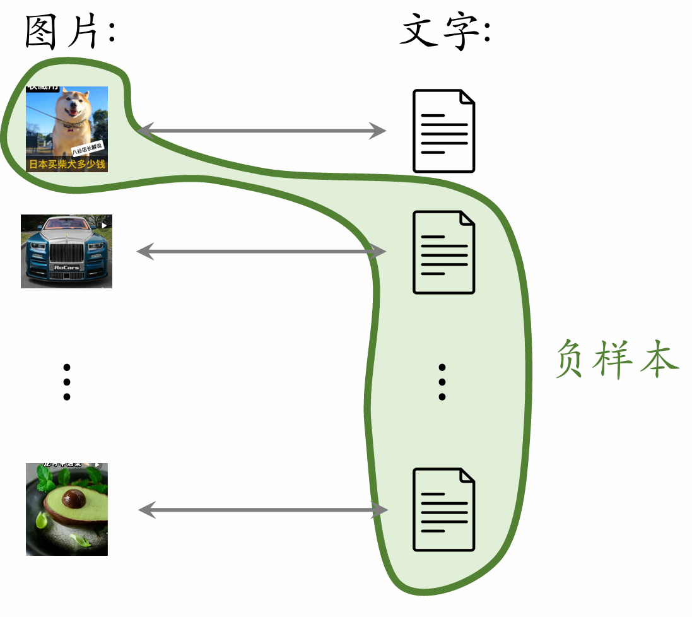

- ⼀个 batch 内有 m 对正样本，任意一行即为一个正样本
- ⼀张图⽚和 m−1 条⽂本组成负样本
- 这个 batch 内⼀共有 m(m-1)对负样本

### 29.3. 提升多样性的⽅法

在粗排和精排之后加入后处理步骤，提升多样性，精排之后的后处理也叫做重排

## 30. MMR 多样性算法

### 30.1. 多样性

- 精排给 n 个候选物品打分，融合之后的分数为 reward$_1$，···，reward$_n$
- 把第 i 和 j 个物品的相似度记作 sim(i, j)
- 从 n 个物品中选出 k 个，既要有⾼精排分数，也要有多样性。

### 30.2. MMR 多样性算法

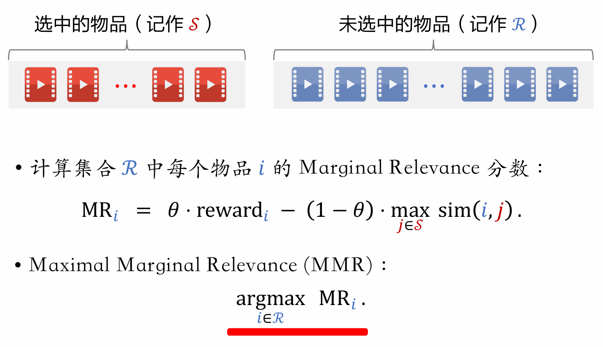

- 计算集合 R 中每个物品 i 的 Marginal Relevance 分数：$MR_i=\theta \cdot \mathrm{reward} _i-(1-\theta)\cdot \max \limits_{j\in s}\mathrm{sim}(i,j)$
- Maximal Marginal Relevance (MMR)：$\arg\max\limits_{i\in R} MR_i$

1. 已选中的物品 S 初始化为空集，未选中的物品 R 初始化为全集{1,⋯,n}
2. 选择精排分数 reward$_i$最⾼的物品，从集合 R 移到 S
3. 做 k−1 轮循环：
   1. 计算集合 R 中所有物品的分数{MR$_i$}$_{i\in R}$
   2. 选出分数最⾼的物品，将其从 R 移到 S

### 30.3. 滑动窗口

- 已选中的物品越多(即集合 S 越⼤)，越难找出物品$i\in R$，使得 i 与 S 中的物品都不相似
- 设 sim 的取值范围是[0,1]。当 S 很⼤时，多样性分数$\max\limits_{j\in S}sim(i,j)$总是约等于 1，导致 MMR 算法失效
- 解决⽅案：设置⼀个滑动窗⼝ W，⽐如最近选中的 10 个物品，⽤ W 代替 MMR 公式中的 S

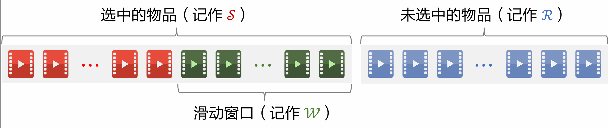
$\arg\max\limits_{i\in R}\{\theta \cdot \mathrm{reward} _i-(1-\theta)\cdot \max \limits_{j\in W}\mathrm{sim}(i,j)\}$

## 31. 重排的规则

1. 最多连续出现 k 篇某种笔记
2. 每 k 篇笔记最多出现 1 篇某种笔记
3. 前 t 篇笔记最多出现 k 篇某种笔记

### 31.3. MMR + 重排规则

- 重排结合 MMR 与规则，在满⾜规则的前提下最⼤化 MR
- 每⼀轮先⽤规则排除掉 R 中的部分物品，得到⼦集 R'
- MMR 公式中的 R 替换成⼦集 R'，选中的物品符合规则
- $\arg\max\limits_{i\in R'}\{\theta \cdot \mathrm{reward} _i-(1-\theta)\cdot \max \limits_{j\in W}\mathrm{sim}(i,j)\}$

## 32. DPP 多样性算法(数学基础)

- ⼀组向量$v_1$,⋯,$v_k\in R^d$可以确定⼀个 k 维超平⾏体：$p(v_1,\cdots,v_k)=\{\alpha_1v_1+\cdots+\alpha_kv_k|0\le\alpha_1,\cdots,\alpha_k\le1\}$
- 要求$k\le d$，⽐如 d=3 维空间中有 k=2 维平⾏四边形
- 如果$v_1$,⋯,$v_k$线性相关，则体积 vol(p)=0(例：有 k = 3 个向量，落在⼀个平⾯上，则平⾏六⾯体的体积为 0)

- 给定 k 个物品，把它们表征为单位向量$v_1$,⋯,$v_k\in R^d$
- ⽤超平⾏体的体积衡量物品的多样性，体积介于 0 和 1 之间
- 如果$v_1$,⋯,$v_k$两两正交(多样性好)，则体积最⼤化，vol=1
- 如果$v_1$,⋯,$v_k$线性相关(多样性差)，则体积最小化，vol=0
- 把它们作为矩阵$V\in R^{d\times k}$的列
- 设$d\ge K$，⾏列式与体积满⾜：det($V^TV$)=vol$(P(v_1,\cdots,v_k))^2$
- 因此，可以⽤⾏列式 det($V^TV$)衡量向量$v_1,\cdots,v_k$的多样性

## 33. DPP 多样性算法

### 33.1. DPP

- DPP 是⼀种传统的统计机器学习⽅法$\arg\max\limits_{S:|S|=k}\log\det(V_s^TV_s)$
  > 从 n 个候选物品中选择 K 个，使得行列式取对数后结果最大
- 将 DPP 应⽤在推荐系统：$\arg\max\limits_{S:|S|=k}\theta\cdot(\sum\limits_{j\in S}\mathrm{reward}_j)+(1-\theta)\cdot \log\det(V_s^TV_s)$

### 33.2. 行列式点过程(DPP)

- $V_s^TV_s=A_s(k\times k)$
- 设 A 为$n\times n$的矩阵，它的(i,j)元素为$a_{ij}=v_i^Tv_j$
- 给定向量$v_1,\cdots,v_k\in R^d$，需要 O($n^2d$)时间计算 A
- $A_s=V_S^TV_S$为 A 的一个$k\times k$子矩阵。如果$i,j\in S$，则$a_{ij}$是$A_S$的一个元素
- DPP 是个组合优化问题，从集合{1,···,n} 中选出⼀个⼤⼩为 k 的⼦集 S
- ⽤ S 表⽰已选中的物品，⽤ R 表⽰未选中的物品，贪⼼算法求解：$\arg\max\limits _{i\in R}\theta \cdot\mathrm{reward_i}+(1-\theta)\cdot \log\det (A _{S\cup \{i\}}) $

### 33.3. 求解 DPP

1. 暴力算法

- 对于单个 i，计算$A_{S\cup \{i\}}$的行列式需要 O($|S|^3$)时间
- 对于所有$i\in R$，计算行列式需要时间$O(|S|^3\cdot|R|)$
- 需要求解上式 K 次才能选出 K 个物品，如果暴力计算行列式，那么总时间复杂度为$O(|S|^3\cdot|R|\cdot k)=O(nk^4)$
- 暴⼒算法的总时间复杂度为$O(n^2d+nk^4)$

2. Hulu 的快速算法

- 给定向量$v_1,\cdots,v_n\in R^d$，需要$O(n^2d)$时间计算 A
- ⽤$O(n^2d)$时间计算所有的⾏列式(利⽤ Cholesky 分解)
- Cholesky 分解$A_s=LL^T$，其中 L 是下三角矩阵(对角线以上的元素全零)
- Cholesky 分解可供计算$A_s=LL^T$的行列式
  - 下三角矩阵 L 的行列式 det(L)等于 L 对角线元素乘积
  - $A_S$的行列式为$\det(A_S)=\det(L)^2=\prod_iL_{ii}^2$
- 已知$A_s=LL^T$，则可以快速求出所有$A _{S\cup \{i\}}$的 Cholesky 分解，因此可以快速算出所有$A _{S\cup \{i\}}$的行列式
- 初始时 S 中只有⼀个物品，$A_S$是 1X1 的矩阵
- 每一轮循环，基于上一轮算出的$A_S=LL^T$，快速求出$A _{S\cup \{i\}}$的 Cholesky 分解($\forall i\in R$)，从而求出$\log\det(A _{S\cup \{i\}})$

3. 滑动窗口

- 随着集合 S 增⼤，其中相似物品越来越多，物品向量会趋近线性相关
- ⾏列式$\det(A_S)$会坍缩到零，对数趋于负无穷
- 贪⼼算法每轮从 R 中选出⼀个物品：$\arg\max\limits _{i\in R}\theta \cdot\mathrm{reward_i}+(1-\theta)\cdot \log\det (A _{W\cup \{i\}}) $(滑动窗口记作 W)

## 34. 物品冷启动：评价指标

### 34.1. 物品冷启动

- ⼩红书上⽤户新发布的笔记
- B 站上⽤户新上传的视频
- 今⽇头条上作者新发布的⽂章

1. 为什么要特殊对待新笔记？

- 新笔记缺少与⽤户的交互，导致推荐的难度⼤、效果差
- 扶持新发布、低曝光的笔记，可以增强作者发布意愿

2. 优化冷启的目标

- 精准推荐：克服冷启的困难，把新笔记推荐给合适的⽤户，不引起⽤户反感
- 激励发布：流量向低曝光新笔记倾斜，激励作者发布
- 挖掘⾼潜：通过初期⼩流量的试探，找到⾼质量的笔记，给与流量倾斜

3. 评价指标

- 作者侧指标
  - 发布渗透率、⼈均发布量
- ⽤户侧指标
  - 新笔记指标：新笔记的点击率、交互率
  - ⼤盘指标：消费时长、⽇活、⽉活
- 内容侧指标
  - ⾼热笔记占⽐

### 34.2. 作者侧指标

- 发布渗透率(penetration rate)
  - 发布渗透率= 当⽇发布⼈数/ ⽇活⼈数
  - 发布⼀篇或以上，就算⼀个发布⼈数
- ⼈均发布量
  - ⼈均发布量= 当⽇发布笔记数/ ⽇活⼈数

### 34.3. ⽤户侧指标

- 新笔记的消费指标
  - 新笔记的点击率、交互率
  - 分别考察⾼曝光、低曝光新笔记
- ⼤盘消费指标
  - ⼤盘的消费时长、⽇活、⽉活

### 34.4. 内容侧指标

- ⾼热笔记占⽐
  - ⾼热笔记：前 30 天获得 1000+次点击
  - ⾼热笔记占⽐越⾼，说明冷启阶段挖掘优质笔记的能⼒越强

### 34.5. 冷启动的优化点

- 优化全链路(包括召回和排序)
- 流量调控(流量怎么在新物品、⽼物品中分配)

## 35. 物品冷启动：简单召回通道

### 35.1. 召回的难点

- 缺少⽤户交互，还没学好笔记 IDembedding，导致双塔模型效果不好
- 缺少⽤户交互，导致 ItemCF(物品协同过滤)不适⽤

### 35.2. 双塔模型

- 改进⽅案 1：新笔记使⽤ defaultembedding
  - 物品塔做 IDembedding 时，让所有新笔记共享⼀个 ID，⽽不是⽤⾃⼰真正的 ID
  - Default embedding：共享的 ID 对应的 embedding 向量
  - 到下次模型训练的时候，新笔记才有⾃⼰的 ID embedding 向量
- 改进⽅案 2：利⽤相似笔记 embedding 向量
  - 查找 top k 内容最相似的⾼曝笔记
  - 把 k 个⾼曝笔记的 embedding 向量取平均，作为新笔记的 embedding
- 多个向量召回池
  - 多个召回池，让新笔记有更多曝光机会(1 ⼩时新笔记,6 ⼩时新笔记,24 ⼩时新笔记,30 天笔记)
  - 共享同⼀个双塔模型，那么多个召回池不增加训练的代价

### 35.3. 类⽬召回

- 系统维护类⽬索引：类⽬ -> 笔记列表(按时间倒排)
- ⽤类⽬索引做召回：⽤户画像 -> 类⽬ -> 笔记列表
- 取回笔记列表上前 k 篇笔记(即最新的 k 篇)

### 35.4. 基于关键词的召回

- 系统维护关键词索引：关键词 -> 笔记列表(按时间倒排)
- 根据⽤户画像上的关键词做召回

类目召回和关键字召回的缺点：

- 缺点 1：只对刚刚发布的新笔记有效
  - 取回某类⽬/关键词下最新的 k 篇笔记
  - 发布⼏⼩时之后，就再没有机会被召回
- 缺点 2：弱个性化，不够精准

## 36. 物品冷启动：聚类召回

### 36.1. 聚类召回

- 如果⽤户喜欢⼀篇笔记，那么他会喜欢内容相似的笔记
- 事先训练⼀个神经⽹络，基于笔记的类⽬和图⽂内容，把笔记映射到向量
- 对笔记向量做聚类，划分为 1000cluster，记录每个 cluster 的中⼼⽅向。(k-means 聚类，⽤余弦相似度)
- ⼀篇新笔记发布之后，⽤神经⽹络把它映射到⼀个特征向量
- 从 1000 个向量(对应 1000 个 cluster)中找到最相似的向量，作为新笔记的 cluster
- 索引：cluster -> 笔记 ID 列表(按时间倒排)
- 给定⽤户 ID，找到他的 last-n 交互的笔记列表，把这些笔记作为种⼦笔记
- 把每篇种⼦笔记映射到向量，寻找最相似的 cluster。(知道了⽤户对哪些 cluster 感兴趣。)
- 从每个 cluster 的笔记列表中，取回最新的 m 篇笔记
- 最多取回 mn 篇新笔记

### 36.2. 内容相似度模型

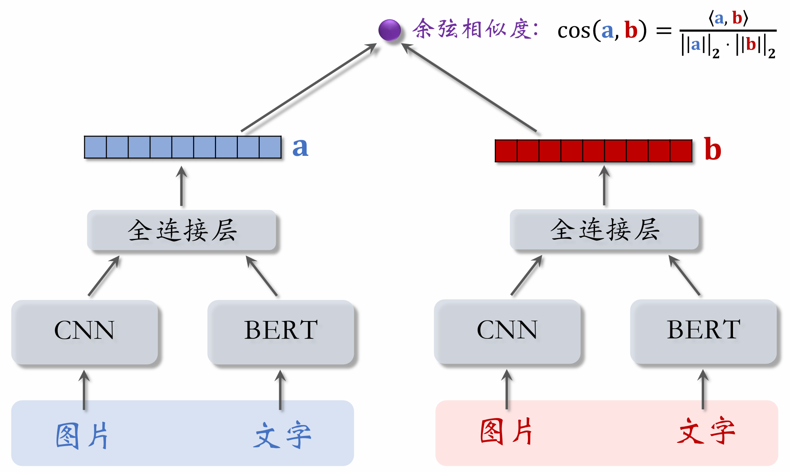
使用 CNN 提取图片特征向量，BERT 提取文字特征向量，再将图片和文字特征向量作向量连接(concatenation)后输入神经网络，输出笔记的特征向量

### 36.3. 训练内容相似度模型

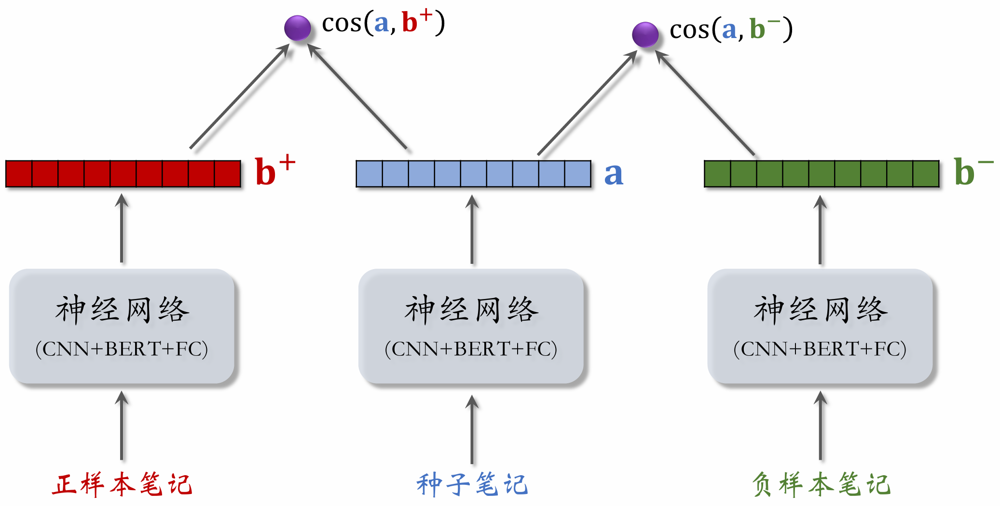
神经网络由 CNN+BERT+全连接层组成，输入一个三元组(正样本，种子笔记，负样本笔记，⿎励$\cos(a,b^+)$⼤于$\cos(a,b^-)$
Triplet hinge loss：$L(a,b^+,b^-)=\max\{0,\cos(a,b^-)+m-\cos(a,b^+)\}$
Triplet logistic loss：$L(a,b^+,b^-)=\log(1+\exp(\cos(a,b^-)-\cos(a,b^+)))$

### 36.4. 正样本

- 人工标注二元组的相似度
- 算法⾃动选正样本
  - 只用高曝光笔记作为二元组(因为有充⾜的⽤户交互信息)
  - 两篇笔记有相同的二级类⽬，⽐如都是“菜谱教程”
  - ⽤ ItemCF 的物品相似度选正样本

### 36.5. 负样本

- 从全体笔记中随机选出满足条件的：
  - 字数较多(神经⽹络提取的⽂本信息有效)
  - 笔记质量⾼，避免图⽂无关

## 37. 物品冷启动：Look-Alike 人群扩散

### 37.1. Look-Alike 起源于互联⽹广告

从符合条件的种子用户中通过人群扩散，找到潜在的用户，成为 Look-Alike 用户

### 37.2. Look-Alike ⽤于新笔记召回

- 点击、点赞、收藏、转发——⽤户对笔记可能感兴趣
- 把有交互的⽤户作为新笔记的种⼦⽤户
- ⽤ look-alike 在相似⽤户中扩散
  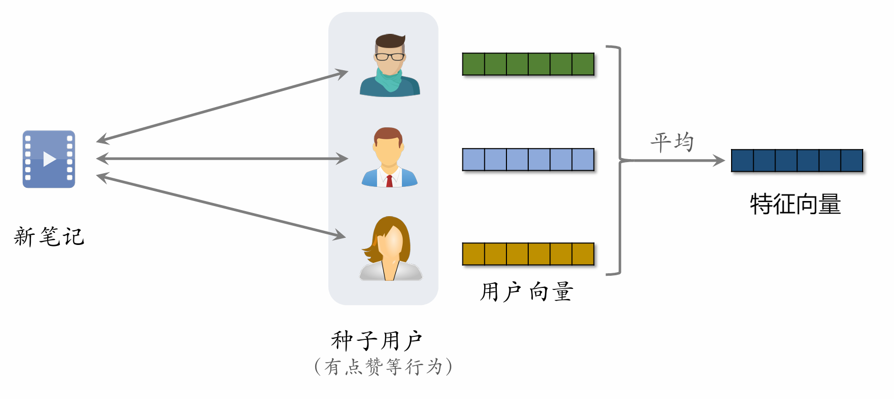
  用户一旦对新笔记产生交互，便把这个用户作为这篇笔记的种子用户，提取所有种子用户的 embedding 向量并求平均，结果作为这篇笔记的特征向量

- 近线更新特征向量(几分钟更新一次)
- 特征向量是有交互的⽤户的向量的平均
- 每当有⽤户交互该物品，更新笔记的特征向量
- 使用向量数据库储存新笔记特征向量。当用户发起刷新请求时，使用用户的 embedding 向量在数据库作最近邻查

## 38. 物品冷启动：流量调控

### 38.1. 冷启动的优化点

- 优化全链路(包括召回和排序)
- 流量调控(流量怎么在新物品、⽼物品中分配)

### 38.2. 扶持新笔记的目的

- ⽬的 1：促进发布，增⼤内容池
  - 新笔记获得的曝光越多，作者创作积极性越⾼
  - 反映在发布渗透率、⼈均发布量
- ⽬的 2：挖掘优质笔记
  - 做探索，让每篇新笔记都能获得⾜够曝光
  - 挖掘的能⼒反映在⾼热笔记占⽐

### 38.3. 工业界的做法

- 假设推荐系统只分发年龄<30 天的笔记
- 假设采⽤⾃然分发，新笔记(年龄<24 ⼩时)的曝光占⽐为 1/30
- 扶持新笔记，让新笔记的曝光占⽐远⼤于 1/30

### 38.4. 流量调控技术的发展

- 在推荐结果中强插新笔记
- 对新笔记的排序分数做提权(boost)
- 通过提权，对新笔记做保量
- 差异化保量

### 38.5. 新笔记提权(boost)

- ⽬标：让新笔记有更多机会曝光
  - 如果做⾃然分发，24 ⼩时新笔记占⽐为 1/30
  - 做⼈为⼲涉，让新笔记占⽐⼤幅提升
- 干涉粗排、重排环节，给新笔记提权
- 优点：容易实现，投⼊产出⽐好
- 缺点：
  - 曝光量对提权系数很敏感
  - 很难精确控制曝光量，容易过度曝光和不充分曝光

### 38.6. 新笔记保量

- 保量：不论笔记质量⾼低，都保证 24 ⼩时获得 100 次曝光
- 在原有提权系数的基础上，乘以额外的提权的系数

1. 动态提权保量
   ⽤下⾯四个值计算提权系数

- ⽬标时间：⽐如 24 ⼩时
- ⽬标曝光：⽐如 100 次
- 发布时间：⽐如笔记已经发布 12 ⼩时
- 已有曝光：⽐如笔记已经获得 20 次曝光
- $\mathrm{提权系数}=f(\frac{\mathrm{发布时间}}{\mathrm{目标时间}}，\frac{\mathrm{已有曝光}}{\mathrm{目标曝光}})=f(0.5,0.2)$

2. 保量的难点
   保量成功率远低于 100%

- 很多笔记在 24 ⼩时达不到 100 次曝光
- 召回、排序存在不⾜
- 提权系数调得不好
  线上环境变化会导致保量失败
- 线上环境变化：新增召回通道、升级排序模型、改变重排打散规则······
- 线上环境变化后，需要调整提权系数

### 38.7. 差异化保量

- 保量：不论新笔记质量⾼低，都做扶持，在前 24 ⼩时给 100 次曝光
- 差异化保量：不同笔记有不同保量⽬标，普通笔记保 100 次曝光，内容优质的笔记保 100~500 次曝光

## 39. 物品冷启动：AB 测试

### 39.1. 新笔记冷启的 AB 测试

- 作者侧指标：
  - 发布渗透率、⼈均发布量
- ⽤户侧指标
  - 对新笔记的点击率、交互率
  - ⼤盘指标：消费时长、⽇活、⽉活(标准的 AB 测试)

### 39.2. ⽤户侧实验

- AB 测试的 diff 是负数(策略组不如对照组)
- 如果推全，diff 会缩⼩(⽐如 −2% -> −1%)
  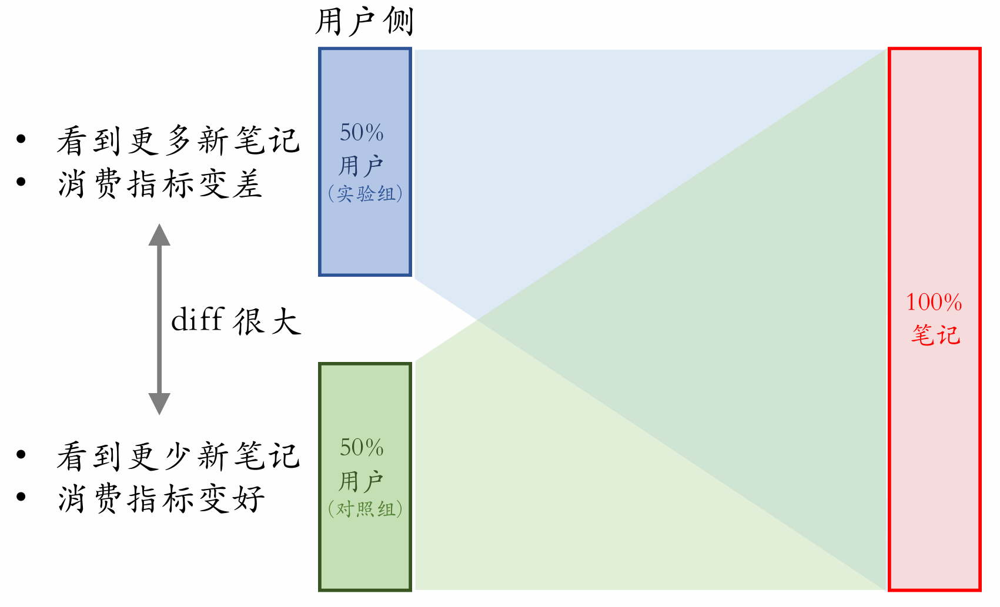

### 39.3. 作者侧实验

## 40. 涨指标的方法

### 40.1. 推荐系统的评价指标

- 日活⽤户数(DAU)和留存是最核⼼的指标
- ⽬前工业界最常⽤ LT7 和 LT30 衡量留存
  - 某⽤户今天($t_0$)登录 APP，未来 7 天($t_0\sim  t_6$)中有 4 天登录 APP，那么该⽤户今天($t_0$)的 LT7 等于 4
  - 显然有 1$\le$LT7$\le$7和1$\le$LT30$\le$30
  - LT 增长通常意味着⽤户体验提升。(除⾮ LT 增长且 DAU 下降。)
  - 假设 APP 禁⽌低活⽤户登录，则 DAU 下降，LT 增长
- 其他核⼼指标：⽤户使⽤时长、总阅读数(即总点击数)、总曝光数。这些指标的重要性低于 DAU 和留存
  - 时长增长，LT 通常会增长
  - 时长增长，阅读数、曝光数可能会下降
- ⾮核⼼指标：点击率、交互率、等等
- 对于 UGC 平台，发布量和发布渗透率也是核⼼指标

### 40.2. 涨指标的方法有哪些？

- 改进召回模型，添加新的召回模型
- 改进粗排和精排模型
- 提升召回、粗排、精排中的多样性
- 特殊对待新⽤户、低活⽤户等特殊⼈群
- 利⽤关注、转发、评论这三种交互⾏为

## 41. 涨指标的方法：召回

### 41.1. 召回模型 & 召回通道

- 推荐系统有⼏⼗条召回通道，它们的召回总量是固定的。总量越⼤，指标越好，粗排计算量越⼤
- 双塔模型(two-tower)和 item-to-item(I2I)是最重要的两类召回模型，占据召回的⼤部分配额
- 有很多⼩众的模型，占据的配额很少。在召回总量不变的前提下，添加某些召回模型可以提升核⼼指标
- 有很多内容池，⽐如 30 天物品、1 天物品、6 ⼩时物品、新⽤户优质内容池、分⼈群内容池
- 同⼀个模型可以⽤于多个内容池，得到多条召回通道

### 41.2. 双塔模型

改进双塔模型

- ⽅向 1：优化正样本、负样本
  - 简单正样本：有点击的(⽤户，物品)⼆元组
  - 简单负样本：随机组合的(⽤户，物品)⼆元组
  - 困难负样本：排序靠后的(⽤户，物品)⼆元组
- ⽅向 2：改进神经⽹络结构
  - Baseline：⽤户塔、物品塔分别是全连接⽹络，各输出⼀个向量，分别作为⽤户、物品的表征
  - 改进：⽤户塔、物品塔分别⽤ DCN 代替全连接⽹络
  - 改进：在⽤户塔中使⽤⽤户⾏为序列(last-n)
  - 改进：使⽤多向量模型代替单向量模型。(标准的双塔模型也叫单向量模型。)
- ⽅向 3：改进模型的训练⽅法
  - Baseline：做⼆分类，让模型学会区分正样本和负样本
  - 改进：结合⼆分类、batch 内负采样。(对于 batch 内负采样，需要做纠偏。)
  - 改进：使⽤⾃监督学习⽅法，让冷门物品的 embedding 学得更好。

### 41.3. Item-to-Item (I2I)

- I2I 是⼀⼤类模型，基于相似物品做召回
- 最常见的⽤法是 U2I2I(user→ item→ item)
  - ⽤户 u 喜欢物品$i_1$(⽤户历史上交互过的物品)
  - 寻找$i_1$的相似物品$i_2$(即 I2I)
  - 将$i_2$推荐给 u

如何计算物品相似度?

- ⽅法 1：ItemCF 及其变体
  - ⼀些⽤户同时喜欢物品$i_1$和$i_2$，则认为$i_1$和$i_2$相似
  - ItemCF 、Online ItemCF、Swing、Online Swing 都是基于相同的思想
  - 线上同时使⽤上述 4 种 I2I 模型，各分配⼀定配额
- ⽅法 2：基于物品向量表征，计算向量相似度。(双塔模型、图神经⽹络均可计算物品向量表征。)

### 41.4. ⼩众的召回模型

- 类似 I2I 的模型
  - U2U2I (user -> user -> item)：已知⽤户$u_1$与$u_2$相似，且$u_2$喜欢物品 i，那么给⽤户$u_1$推荐物品 i
  - U2A2I (user -> author -> item)：已知⽤户 u 喜欢作者 a，且 a 发布物品 i，那么给⽤户 u 推荐物品 i
  - U2A2A2I (user -> author -> author -> item)：已知⽤户 u 喜欢作者$a_1$，且$a_1$与$a_2$相似，$a_2$发布物品 i，那么给⽤户 u 推荐物品 i

## 42. 涨指标的方法：排序模型

### 42.1. 精排模型的改进

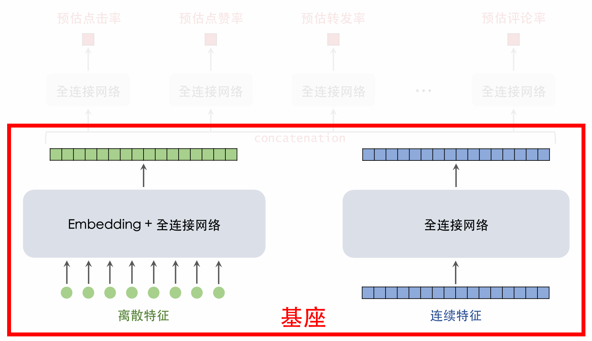

- 基座的输⼊包括离散特征和连续特征，输出⼀个向量，作为多⽬标预估的输⼊
  - 改进 1：基座加宽加深，计算量更⼤，预测更准确
  - 改进 2：做⾃动的特征交叉，⽐如 bilinear 和 LHUC
  - 改进 3：特征⼯程，⽐如添加统计特征、多模态内容特征
- 基于基座输出的向量，同时预估点击率等多个⽬标
  - 改进 1：增加新的预估⽬标，并把预估结果加⼊融合公式
    - 最标准的⽬标包括点击率、点赞率、收藏率、转发率、评论率、关注率、完播率……
    - 寻找更多⽬标，⽐如进⼊评论区、给他⼈写的评论点赞……
    - 把新的预估⽬标加⼊融合公式
  - 改进 2：MMoE、PLE 等结构可能有效，但往往无效
  - 改进 3：纠正 position bias 可能有效，也可能无效

### 42.2. 粗排模型的改进

- 粗排的打分量⽐精排⼤ 10 倍，因此粗排模型必须够快
- 简单模型：多向量双塔模型，同时预估点击率等多个⽬标
- 复杂模型：三塔模型效果好，但工程实现难度较⼤

1. 粗精排一致性建模

- 蒸馏精排训练粗排，让粗排与精排更⼀致
- ⽅法 1：pointwise 蒸馏
  - 设 y 是⽤户真实⾏为，设 p 是精排的预估
  - ⽤(y+p)/2 作为粗排拟合的⽬标
- ⽅法 2：pairwise 或 listwise 蒸馏
  - 给定 k 个候选物品，按照精排预估做排序
  - 做 learning to rank (LTR)，让粗排拟合物品的序(⽽⾮值)
- 优点：粗精排⼀致性建模可以提升核⼼指标
- 缺点：如果精排出 bug，精排预估值 p 有偏，会污染粗排训练数据

### 42.3. ⽤户⾏为序列建模

- 最简单的⽅法是对物品向量取平均，作为⼀种⽤户特征
- DIN 使⽤注意⼒机制，对物品向量做加权平均
- ⼯业界⽬前沿着 SIM 的⽅向发展。先⽤类⽬等属性筛选物品，然后⽤ DIN 对物品向量做加权平均

- 改进 1：增加序列长度，让预测更准确，但是会增加计算成本和推理时间
- 改进 2：筛选的⽅法，⽐如⽤类⽬、物品向量表征聚类
  - 离线⽤多模态神经⽹络提取物品内容特征，将物品表征为向量
  - 离线将物品向量聚为 1000 类，每个物品有⼀个聚类序号
  - 线上排序时，⽤户⾏为序列中有 n=1,000,000 个物品。某候选物品的聚类序号是 70，对 n 个物品做筛选，只保留聚类序号为 70 的物品。n 个物品中只有数千个被保留下来
  - 同时有好⼏种筛选⽅法，取筛选结果的并集
- 改进 3：对⽤户⾏为序列中的物品，使⽤ ID 以外的⼀些特征
- 概括：沿着 SIM 的⽅向发展，让原始的序列尽量长，然后做筛选降低序列长度，最后将筛选结果输⼊ DIN

### 42.4. 在线学习

- 在线学习对指标的提升巨⼤，但是会制约模型开发迭代的效率
- 线上有 m 个模型，其中 1 个是 holdout，1 个是推全的模型，m−2 个测试的新模型
- 每套在线学习的机器成本都很⼤，因此 m 数量很⼩，制约模型开发迭代的效率

### 42.5. 老汤模型

- ⽤每天新产⽣的数据对模型做 1epoch 的训练
- 久⽽久之，⽼模型训练得⾮常好，很难被超过
- 问题 1：如何快速判断新模型结构是否优于⽼模型？(不需要追上线上的⽼模型，只需要判断新⽼模型谁的结构更优。)
  - 对于新、⽼模型结构，都随机初始化模型全连接层
  - Embedding 层可以是随机初始化，也可以是复⽤⽼模型训练好的参数
  - ⽤ n 天的数据训练新⽼模型。(从旧到新，训练 1epoch)
  - 如果新模型显著优于⽼模型，新模型很可能更优
  - 只是⽐较新⽼模型结构谁更好，⽽⾮真正追平⽼模型
- 问题 2：如何更快追平、超过线上的⽼模型？(只有⼏⼗天的数据，新模型就能追上训练上百天的⽼模型。)
  - 已经得出初步结论，认为新模型很可能优于⽼模型。⽤⼏⼗天的数据训练新模型，早⽇追平⽼模型
  - ⽅法 1：尽可能多地复⽤⽼模型训练好的 embedding 层，避免随机初始化 embedding 层。(Embedding 层是对⽤户、物品特点的“记忆”，⽐全连接层学得慢。)
  - ⽅法 2：⽤⽼模型做 teacher，蒸馏新模型。(⽤户真实⾏为是 y，⽼模型的预测是 p，⽤(y+p)/2 作为训练新模型的⽬标。)

## 43. 涨指标的方法：多样性

### 43.1. 精排多样性

- 精排阶段，结合兴趣分数和多样性分数对物品 i 排序
  - $s_i$：兴趣分数，即融合点击率等多个预估⽬标
  - $d_i$：多样性分数，即物品 i 与已经选中的物品的差异
  - ⽤$s_i+d_i$对物品做排序
- 常⽤ MMR、DPP 等⽅法计算多样性分数，精排使⽤滑动窗⼝，粗排不使⽤滑动窗⼝
  - 精排决定最终的曝光，曝光页⾯上邻近的物品相似度应该⼩。所以计算精排多样性要使⽤滑动窗⼝
  - 粗排要考虑整体的多样性，⽽⾮⼀个滑动窗⼝中的多样性
- 除了多样性分数，精排还使⽤打散策略增加多样性
  - 类⽬：当前选中物品 i，之后 5 个位置不允许跟 i 的⼆级类⽬相同
  - 多模态：事先计算物品多模态内容向量表征，将全库物品聚为 1000 类；在精排阶段，如果当前选中物品 i，之后 10 个位置不允许跟 i 同属⼀个聚类

### 43.2. 粗排多样性

- 粗排给 5000 个物品打分，选出 500 个物品送⼊精排
- 提升粗排和精排多样性都可以提升推荐系统核⼼指标
- 根据$s_i$对 5000 个物品排序，分数最⾼的 200 个物品送⼊精排
- 对于剩余的 4800 个物品，对每个物品 i 计算兴趣分数$s_i$和多样性分数$d_i$
- 根据$s_i+d_i$对剩余 4800 个物品排序，分数最⾼的 300 个物品送⼊精排

### 43.3. 双塔模型：添加噪声

- ⽤户塔将⽤户特征作为输⼊，输出⽤户的向量表征；然后做 ANN 检索，召回向量相似度⾼的物品
- 线上做召回时(在计算出⽤户向量之后，在做 ANN 检索之前)，往⽤户向量中添加随机噪声
- ⽤户的兴趣越窄(⽐如⽤户最近交互的 n 个物品只覆盖少数⼏个类⽬)，则添加的噪声越强
- 添加噪声使得召回的物品更多样，可以提升推荐系统核⼼指标

### 43.4. 双塔模型：抽样用户行为序列

- ⽤户最近交互的 n 个物品(⽤户⾏为序列)是⽤户塔的输⼊
- 保留最近的 r 个物品(r$\ll$n)
- 从剩余的 n-r 个物品中随机抽样 𝑡 个物品(t$\ll$n)。(可以是均匀抽样，也可以⽤⾮均匀抽样让类⽬平衡。)
- 将得到的 r+t 个物品作为⽤户⾏为序列，⽽不是⽤全部 n 个物品
- 抽样⽤户⾏为序列为什么能涨指标？
  - ⼀⽅⾯，注⼊随机性，召回结果更多样化
  - 另⼀⽅⾯，n 可以⾮常⼤，可以利⽤到⽤户很久之前的兴趣

### 43.5. U2I2I：抽样用户行为序列

- U2I2I(user -> item -> item)中的第⼀个 item 是指⽤户最近交互的 n 个物品之⼀，在 U2I2I 中叫作种⼦物品
- n 个物品覆盖的类⽬数较少，且类⽬不平衡
- 做⾮均匀随机抽样，从 n 个物品中选出 t 个，让类⽬平衡(想法和效果与双塔中的⽤户⾏为序列抽样相似。)
- ⽤抽样得到的 t 个物品(代替原本的 n 个物品)作为 U2I2I 的种⼦物品
- ⼀⽅⾯，类⽬更平衡，多样性更好。另⼀⽅⾯，n 可以更⼤，覆盖的类⽬更多

### 43.6. 探索流量

- 每个⽤户曝光的物品中有 2%是⾮个性化的，⽤作兴趣探索
- 维护⼀个精选内容池，其中物品均为交互率指标⾼的优质物品。(内容池可以分⼈群，⽐如 30~40 岁男性内容池。)
- 从精选内容池中随机抽样⼏个物品，跳过排序，直接插⼊最终排序结果
- 兴趣探索在短期内负向影响核⼼指标，但长期会产⽣正向影响

## 44. 涨指标的方法：特殊对待特殊人群

### 44.1. 为什么要特殊对待特殊人群？

- 新⽤户、低活⽤户的⾏为很少，个性化推荐不准确
- 新⽤户、低活⽤户容易流失，要想办法促使他们留存
- 特殊⽤户的⾏为(⽐如点击率、交互率)不同于主流⽤户，基于全体⽤户⾏为训练出的模型在特殊⽤户⼈群上有偏

### 44.2. 构造特殊的内容池

- 新⽤户、低活⽤户的⾏为很少，个性化召回不准确。(既然个性化不好，那么就保证内容质量好。)
- 针对特定⼈群的特点构造特殊内容池，提升⽤户满意度。(例如，对于喜欢留评论的中年⼥性，构造促评论内容池，满⾜这些⽤户的互动需求。)

1. 如何构造特殊内容池?

- ⽅法 1：根据物品获得的交互次数、交互率选择优质物品
  - 圈定⼈群：只考虑特定⼈群，例如 18~25 岁⼀⼆线城市男性
  - 构造内容池：⽤该⼈群对物品的交互次数、交互率给物品打分，选出分数最⾼的物品进⼊内容池
  - 内容池有弱个性化的效果
  - 内容池定期更新，加⼊新物品，排除交互率低和失去时效性的⽼物品
  - 该内容池只对该⼈群⽣效
- ⽅法 2：做因果推断，判断物品对⼈群留存率的贡献，根据贡献值选物品

2. 特殊内容池的召回

- 通常使⽤双塔模型从特殊内容池中做召回
  - 双塔模型是个性化的
  - 对于新⽤户，双塔模型的个性化做不准
  - 靠⾼质量内容、弱个性化做弥补
- 额外的训练代价
  - 对于正常⽤户，不论有多少内容池，只训练⼀个双塔模型
  - 对于新⽤户，由于历史交互记录很少，需要单独训练模型
- 额外的推理代价
  - 内容池定期更新，然后要更新 ANN 索引
  - 线上做召回时，需要做 ANN 检索
  - 特殊内容池都很⼩(⽐全量内容池⼩ 10~100 倍)，所以需要的额外算⼒不⼤

### 44.3. 特殊的排序策略

1. 排除低质量物品

- 对于新⽤户、低活⽤户这样的特殊⼈群，业务上只关注留存，不在乎消费(总曝光量、广告收⼊、电商收⼊)
- 对于新⽤户、低活⽤户，少出广告、甚⾄不出广告
- 新发布的物品不在新⽤户、低活⽤户上做探索
  - 物品新发布时，推荐做得不准，会损害⽤户体验
  - 只在活跃的⽼⽤户上做探索，对新物品提权(boost)
  - 不在新⽤户、低活⽤户上做探索，避免伤害⽤户体验

2. 差异化的融分公式

- 新⽤户、低活⽤户的点击、交互⾏为不同于正常⽤户
- 低活⽤户的⼈均点击量很⼩；没有点击就不会有进⼀步的交互
- 低活⽤户的融分公式中，提⾼预估点击率的权重(相较于普通⽤户)
- 保留⼏个曝光坑位给预估点击率最⾼的⼏个物品
  - 例：精排从 500 个物品中选 50 个作为推荐结果，其中 3 个坑位给点击率最⾼的物品，剩余 47 个坑位由融分公式决定。
  - 甚⾄可以把点击率最⾼的物品排在第⼀，确保⽤户⼀定能看到

### 44.4. 特殊的排序模型

- 特殊⽤户⼈群的⾏为不同于普通⽤户。新⽤户、低活⽤户的点击率、交互率偏⾼或偏低
- 排序模型被主流⽤户主导，对特殊⽤户做不准预估

1. ⽅法 1：⼤模型+⼩模型

- ⽤全体⽤户⾏为训练⼤模型，⼤模型的预估 p 拟合⽤户⾏为 y
- ⽤特殊⽤户的⾏为训练⼩模型，⼩模型的预估 q 拟合⼤模型的残差 y-p
- 对主流⽤户只⽤⼤模型做预估 p
- 对特殊⽤户，结合⼤模型和⼩模型的预估 p+q

2. ⽅法 2：融合多个 experts，类似 MMoE

- 只⽤⼀个模型，模型有多个 experts，各输出⼀个向量
- 对 experts 的输出做加权平均
- 根据⽤户特征计算权重
- 以新⽤户为例，模型将⽤户的新⽼、活跃度等特征作为输⼊，输出权重，⽤于对 experts 做加权平均

3. ⽅法 3：⼤模型预估之后，⽤⼩模型做校准

- ⽤⼤模型预估点击率、交互率
- 将⽤户特征、⼤模型预估点击率和交互率作为⼩模型(例如 GBDT)的输⼊
- 在特殊⽤户⼈群的数据上训练⼩模型，⼩模型的输出拟合⽤户真实⾏为

## 45. 涨指标的方法：利用交互行为

### 45.1. 关注

- 对于⼀位⽤户，他关注的作者越多，则平台对他的吸引⼒越强
- ⽤户留存率(r)与他关注的作者数量(f)正相关
- 如果某⽤户的 f 较⼩，则推荐系统要促使该⽤户关注更多作者

1. ⽅法 1：⽤排序策略提升关注量

- 对于⽤户 u，模型预估候选物品 i 的关注率为$p_i$
- 设⽤户 u 已经关注了 f 个作者
- 我们定义单调递减函数 w(f)，⽤户已经关注的作者越多，则 w(f)越⼩
- 在排序融分公式中添加 w(f)·$p_i$，⽤于促关注。(如果 f ⼩且$p_i$⼤，则 w(f)·$p_i$给物品 i 带来很⼤加分)

2. ⽅法 2：构造促关注内容池和召回通道

- 这个内容池中物品的关注率⾼，可以促关注
- 如果⽤户关注的作者数 f 较⼩，则对该⽤户使⽤该内容池
- 召回配额可以固定，也可以与 f 负相关

3. 粉丝数对促发布的价值

- UGC 平台将作者发布量、发布率作为核⼼指标，希望作者多发布
- 作者发布的物品被平台推送给⽤户，会产⽣点赞、评论、关注等交互
- 交互(尤其是关注、评论)可以提升作者发布积极性
- 作者的粉丝数越少，则每增加⼀个粉丝对发布积极性的提升越⼤
- ⽤排序策略帮助低粉新作者涨粉
- 某作者 a 的粉丝数(被关注数)为$f_a$
- 作者 a 发布的物品 i 可能被推荐给⽤户 u，模型预估关注率为$p_{ui}$
- 我们定义单调递减函数 w($f_a$)作为权重；作者 a 的粉丝越多，则 w($f_a$)越⼩
- 在排序融分公式中添加 w($f_a$)·$p_{ui}$，帮助低粉作者涨粉

4. 隐式关注关系

- 召回通道 U2A2I：user -> author -> item
- 显式关注关系：⽤户 u 关注了作者 a，将 a 发布的物品推荐给 u。(点击率、交互率指标通常⾼于其他召回通道)
- 隐式关注关系：⽤户 u 喜欢看作者 a 发布的物品，但是 u 没有关注 a
- 隐式关注的作者数量远⼤于显式关注。挖掘隐式关注关系，构造 U2A2I 召回通道，可以提升推荐系统核⼼指标

### 45.2. 转发(分享)

### 45.3. 评论
